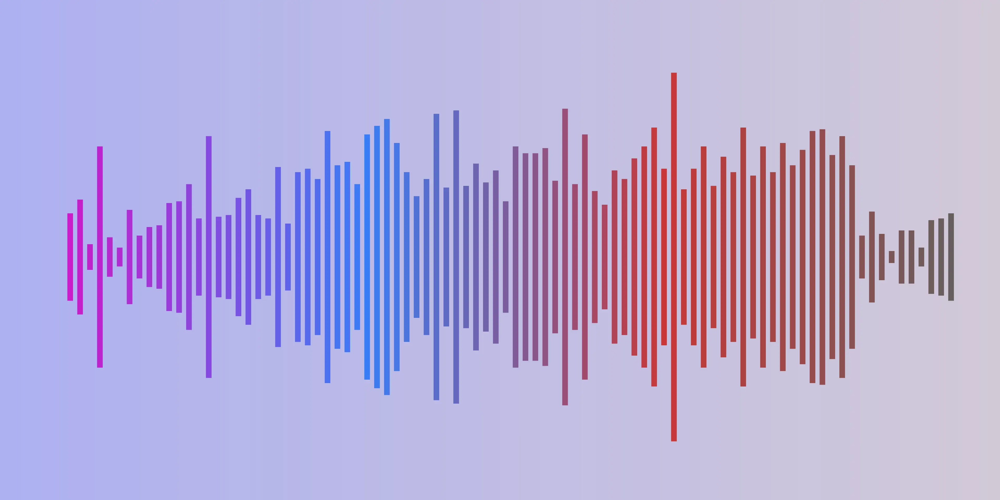
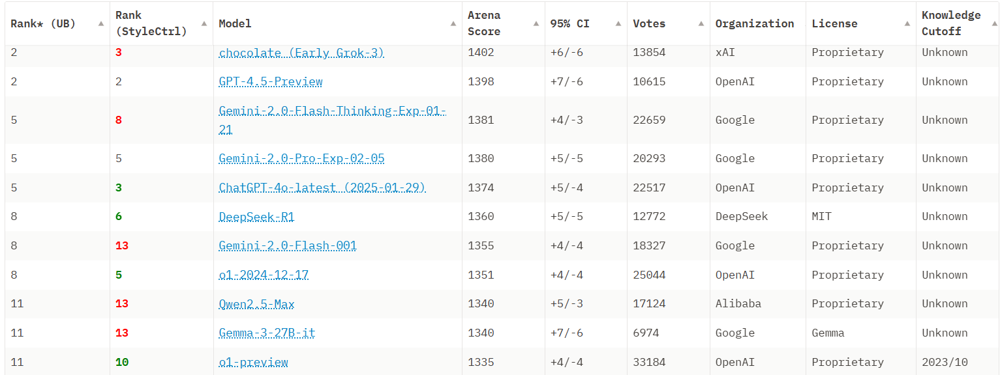

# AI Development Tracker: Latest Breakthroughs & Tools

[](https://www.reddit.com/r/ChatGPT/comments/1jjyn5q/openais_new_4o_image_generation_is_insane/)

## Runway Gen-4: SOTA Media (which means videos with synchronised audio) Generation Models with World Consistency (Apr 1, 2025)

[Runway](https://runwayml.com/?utm_source=theneuron) has released [Gen-4](https://runwayml.com/research/introducing-runway-gen-4), solving a major challenge in AI video generation. You can now create characters and objects that maintain consistent appearance across different scenes, angles and environments using just one reference image. (*That's called 'Object Consistency', far from perfect, but increasing difficult to identify by naked eyes?*)

!!! tip "Runway's Official Video (there are flaws, still, but decent enough?)"

    <iframe width="100%" height="315" src="https://www.youtube-nocookie.com/embed/uRkfzKYFOxc?si=u8z1fpNFEyLy7YhP" title="YouTube video player" frameborder="0" allow="accelerometer; autoplay; clipboard-write; encrypted-media; gyroscope; picture-in-picture; web-share" referrerpolicy="strict-origin-when-cross-origin" allowfullscreen></iframe>


## OpenAI's GPT-4o Takes Chat-based Image Generation to New Heights (Mar 28, 2025)

!!! quote "ChatGPT Gains 1M users in an Hour with GPT-4o Image Generation"

    Sam Altman announced on Mar 31. ChatGPT gains its first 1M users within 5 days since it is launched.

OpenAI has [launched native image generation directly within GPT-4o](https://openai.com/index/introducing-4o-image-generation/), arriving two weeks after Google's Gemini 2.0 Flash release. According to [WhyTryAI](https://www.whytryai.com/p/openai-4o-native-image-generation), this timing wasn't coincidental— it's OpenAI's answer, but with better capability.

What sets this apart from traditional image generators is the intuitive chat interface combined with surprisingly high-quality output. Users don't need to learn specialised prompting techniques; they simply describe what they want in natural language and GPT-4o delivers with remarkable accuracy, particularly with text rendering—a longstanding challenge for AI image tools.

You can access this feature in two ways: directly in ChatGPT (where images appear line by line as they're created) or through [sora.com](https://sora.com) by switching from "Video" to "Image" format. Both options offer the ability to make precise edits through conversation rather than starting over with new prompts.

Currently available to Plus, Pro, and Team subscribers, this integration may signal a shift away from standalone image generation platforms toward unified AI assistants that handle multiple media types through natural conversation.

!!! warning "Hong Kong Access Note"
    You'll need a VPN to access ChatGPT from Hong Kong due to regional restrictions on OpenAI Services.

???+ example "Amazing Examples of GPT-4o Image Generation"
    
    ???- note "Artistic Style Transformations"
    
        [](https://x.com/op7418/status/1904815000205877471)
        
        **Style Morphing**: One person's face rendered across multiple artistic styles simultaneously
        
        ---
        
        [](https://www.yahoo.com/lifestyle/studio-ghibli-memes-over-internet-220732993.html?guccounter=1)
        
        **Ghibli Remix**: Popular internet memes reimagined in Hayao Miyazaki's iconic animation style
        
        ---
        
        [](https://x.com/gfodor/status/1904754510595317856)
        
        **Voxel Mastery**: Complex 3D pixel art with consistent perspective and lighting

    ???- tip "Clear Visual Instructions & Infographics"

        [](https://x.com/minchoi/status/1904689049475989574)
        
        **Visual Storytelling**: Simulated images with consistent visual style
        
        ---
        
        [](https://www.reddit.com/r/ChatGPT/comments/1jk0g0m/1960s_comic_book_covers_new_image_generator_is/)
        
        **Retro Comics**: Perfect recreation of 1960s comic aesthetic including period-accurate typography
        
        ---
        
        [](https://www.reddit.com/r/ChatGPT/comments/1jk8vu4/it_knows_how_to_make_pasta_and_this_is_without_me/)
        
        **Cooking Tutorial**: Step-by-step pasta making instructions with consistent visual design
        
        ---
        
        [](https://www.reddit.com/r/ChatGPT/comments/1jk4pcy/holy_hell_it_knows_how_to_cook_eggs_now/)
        
        **Culinary Guide**: Comprehensive visual explanation of different egg cooking techniques

    ???- success "Technical Utilities"

        [](https://x.com/OpenAI/status/1904602856830943674)
        
        **Text Accuracy**: Flawless text rendering with proper spelling - a long-standing AI image generation challenge
        
        ---
        
        [](https://x.com/apollonator3000/status/1904845860124360893)
        
        **Object Isolation**: Creating transparent background assets that closely resemble original images
        
        ---
        
        [](https://x.com/jsngr/status/1904724799638667500)
        
        **Interface Design**: Generating functional UI mockups from descriptions with consistent design language

    ???- warning "Impressive Yet Concerning Applications"

        [](https://www.reddit.com/r/ChatGPT/comments/1jkaaxh/gpt4o_image_generation_is_absolutely_insane/)
        
        **Cross-Media Integration**: Seamlessly placing animated characters into photorealistic backgrounds (Actually, ANY into ANY)
        
        ---
        
        [](https://x.com/tobi/status/1904706964224901317)
        
        **Scientific Illustration**: Creating anatomy diagrams of fictional characters (Note: Labels may be factually incorrect)
        

        

---

## Gemini 2.5 Pro Takes the Lead (March 26, 2025)

???- tip "Check this 20-minute video about Gemini by "AI Explained" Challel for full review"
    
    <iframe width="100%" height="315" src="https://www.youtube-nocookie.com/embed/kTslCsPBGHw?si=EMggmZCTI-ItkJOu" title="YouTube video player" frameborder="0" allow="accelerometer; autoplay; clipboard-write; encrypted-media; gyroscope; picture-in-picture; web-share" referrerpolicy="strict-origin-when-cross-origin" allowfullscreen></iframe>


Google has released Gemini 2.5 Pro Experimental, claiming the top spot on LMArena for reasoning, coding, and overall performance. This comes just one day after DeepSeek V3-0324 (currently the most powerful open-source model, in match with Claude 3.5), positions Gemini 2.5 Pro ahead of any competitors with a score of 1443 in [LMArena Leaderboard](https://huggingface.co/spaces/lmarena-ai/chatbot-arena-leaderboard).

!!! info "What is LMArena?"
    LMArena is a community-driven benchmark that evaluates AI models through direct, blind comparisons on diverse real-world tasks.



What makes Gemini 2.5 Pro stand out is its massive 1 million token context window, advanced structured outputs, and exceptional tool use capabilities. While benchmarks are always task-specific and should be taken with caution, Gemini 2.5 appears to be setting new standards for AI performance.

Want to see it in action? Check out [WorldofAI's 12 minute explainer](https://www.youtube.com/watch?v=gfCpfTgsL7k) showcasing its capabilities.

---

## OpenAI Challenges ElevenLabs with New Audio Models (March 20, 2025)

OpenAI has released [three new audio models](https://openai.com/index/introducing-our-next-generation-audio-models/) that could reshape the voice AI market. The lineup includes two speech-to-text models (`gpt-4o-transcribe` and `gpt-4o-mini-transcribe`) that outperform Whisper, plus a new text-to-speech model (`gpt-4o-mini-tts`) that responds to stylistic instructions.

!!! info "ElevenLabs"
    ElevenLabs is currently the industry leader in voice AI, offering hundreds of licensed voices from real people with high-quality emotional range.

The most compelling feature might be the pricing: at just $0.015 per minute, OpenAI's TTS is approximately 85% cheaper than ElevenLabs. That means you could get around 11,000 minutes of audio for about $165 instead of paying ElevenLabs over $1,000 for the same amount.

Try it yourself at [OpenAI.fm](https://www.openai.fm/), where you can select voices, choose vibes, edit scripts, and customize prompts to control voice characteristics, tone, speech mannerisms, pronunciation, and tempo.


---

## Create Images Through Conversation with Gemini 2.0 Flash (March 12, 2025)

Google has launched [Gemini 2.0 Flash with native image generation](https://developers.googleblog.com/en/experiment-with-gemini-20-flash-native-image-generation/), available through [Google AI Studio](https://aistudio.google.com/prompts/new_chat?model=gemini-2.0-flash-exp-image-generation). This tool allows you to create and edit images through natural conversation rather than complex prompts.

!!! warning "Hong Kong Access Note"
    You'll need a VPN to access Google AI Studio from Hong Kong due to regional restrictions on Google services.

The model excels at four key tasks: generating illustrated stories with consistent characters, (able for) editing images through multi-turn dialogue, creating accurate knowledge-based visualisations, and rendering text in images (where many other AI systems struggle).

Some developers are already creating impressive workflows combining Midjourney with Google AI Studio for multi-angle image creation. See this approach demonstrated in [this 11-minute video tutorial](https://www.youtube.com/watch?v=iKUdeKYnt6Y) or check out [this workflow example on X](https://x.com/Ror_Fly/status/1903068674770014706) (this is his demonstration image below).


???+ example "Midjourney + Google AI Studio Workflow"
    **Process:**

    1. Create base image in Midjourney
    2. Change perspective in Google AI Studio
    3. Optional: Train a LORA model
    
    **Midjourney Prompt:**
    ```
    side view, plexiglass translucent futuristic car in a sharp studio, the body of the car
    is completely see-through soft aesthetic contrasting against the background, smooth curves
    and contours, deep textured off-road tires, soft studio lighting, high precision photography,
    blocks of text and layers of depth ordered neatly on the car, clean and sleek, accenting
    shadows, clear wiring and mechanical engineering contrasting inside the anatomy of the car
    --chaos 5 --ar 3:2 --quality 2 --profile 9ikiq5k yvrnvah 7lgpc2a --stylize 850
    ```
    
    **Google AI Studio Prompt:**
    ```
    Let's get a [perspective] of this car in a white studio.
    ```
    **Result:**
    
---

## AI-Generated Murder Mysteries from Wolf Games (March 12, 2025)

Wolf Games has created "Public Eye," a game that uses AI to generate new murder mysteries daily. Set in a future where police ask citizens to help solve crimes, players become digital detectives examining evidence and interviewing suspects.

The game uses AI to create everything from storylines to crime scene photos, with the content refreshing daily - something that would be impossible for human writers to produce at this pace.

<iframe width="672" height="378" src="https://www.youtube-nocookie.com/embed/6aqKmlBgAnE?si=IHLhkzqlmyFdnu2s" title="YouTube video player" frameborder="0" allow="accelerometer; autoplay; clipboard-write; encrypted-media; gyroscope; picture-in-picture; web-share" referrerpolicy="strict-origin-when-cross-origin" allowfullscreen></iframe>

Check out the above [official teaser trailer](https://www.youtube.com/watch?v=6aqKmlBgAnE) or visit their website [wolfgames.net/publiceye](https://wolfgames.net/publiceye) where "Law enforcement has made an unprecedented call for help."

The free-to-play web game will launch this summer and represents an interesting example of how AI can create interactive entertainment with constantly fresh content.