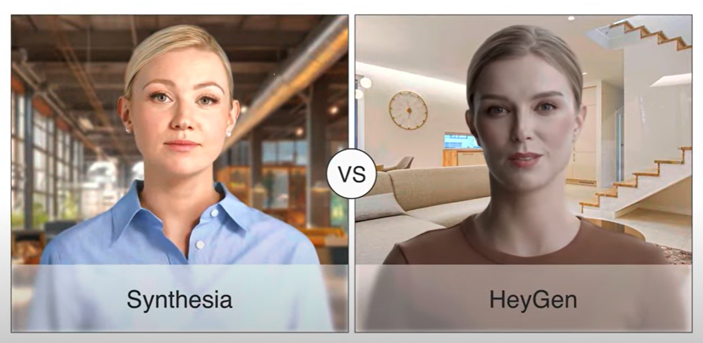

# AI-powered Video Generation

## Introduction
AI video generation refers to the process of creating video content using artificial intelligence technologies. This innovative approach allows for the production of high-quality videos with minimal human intervention. One of the key components of AI video generation is the use of generative AI avatars and voice cloning, which enable the creation of lifelike digital presenters and natural-sounding speech for a wide range of applications.

## Applications

### Generative AI Avatars

<figure markdown="span">
  { loading=lazy }
  <figcaption>Comparsion between Synthesia & HeyGen - Retrieved from <a href="https://www.youtube.com/watch?v=q74u5RcHI2E" target="_blank" rel="noopener">this Youtube Video in 2024</a> </figcaption>
</figure>

Generative AI avatars are advanced digital characters created using artificial intelligence technology. These avatars appear as lifelike human figures in videos or interactive interfaces, capable of speaking, moving, and expressing emotions realistically. They're "generative" because they can create new content based on input, rather than just playing back pre-recorded material.

Two prominent platforms offering this technology are [HeyGen](https://www.heygen.com/) and [Synthesia](https://www.synthesia.io/).

!!! tip "The Digital Twin Concept"
    For a deeper dive into how educators are using "Digital Twins" (combining custom avatars with voice cloning) to scale their presence, see our dedicated explainer: **[The Digital Twin: AI Avatars & Voice](digital-twin.md)**.

Here's how they work and can be used in education:

1. Content Creation: Educators input a script or lesson plan into the AI system. The avatar then generates a video of itself delivering this content, complete with natural speech and appropriate gestures.
2. Agile Content Management: Unlike traditional video content, which requires re-shooting when information becomes outdated, AI avatar videos can be quickly and easily updated. If there's a curriculum change or new developments in the field, educators can simply edit the script and regenerate the video.
3. Scalability: Once created, these avatar-led lessons can be easily shared with any number of students, making them a powerful tool for online or distance learning. Educators can produce multiple version of a lesson quickly based on students' responses and progress
4. Accessibility: AI avatars can present content in multiple languages and accents and add subtitles automatically.

### Avatar Mimic (Deepfake) and Voice Cloning

Deepfake technology and voice cloning are advanced AI techniques that can create highly realistic simulations of real people's appearances and voices. In an educational context, these technologies offer intriguing possibilities:

1. Cultural and Diversity Education. These technologies can create content that represents diverse ethnicities and backgrounds.
2. Historical Re-enactments: These technologies can bring historical figures to life, allowing students to "see" and "hear" important personalities from the past delivering lectures or speeches.
3. Personalised Feedback: Teachers could use voice cloning to use their own voices that student find familiar and comforting to provide personalised audio feedback on assignments, saving time while maintaining a personal touch.

Some AI avatar companies provide the option of creating custom avatars to represent specific instructors directly, though this is often either prohibitively expensive or highly restrictive. There are free, open-source alternatives available on platforms like GitHub, but these typically involve a high level of technical expertise and don't always produce satisfactory results.

Similarly, companies like ElevenLabs offer intuitive ways to clone your own voice within seconds, but these services may raise significant privacy concerns. Users must consider the potential risks of sharing their biometric voice data with these platforms.

## Final Remarks

Generative AI can also yield realistic replicas of celebrities, and literally anybody if one has enough data for training. While it certainly sounds impressive to teach a sociology lesson by Max Weber and Karl Marx, or hold a debate on economics by Adam Smith, John Maynard Keynes and Milton Friedman, it remains controversial on whether we have the "simulation right" of influencers in the world. While it may seem educational to have historical figures "teach" lessons, there's a risk of misrepresentation or putting words in someone's mouth they never actually said.

