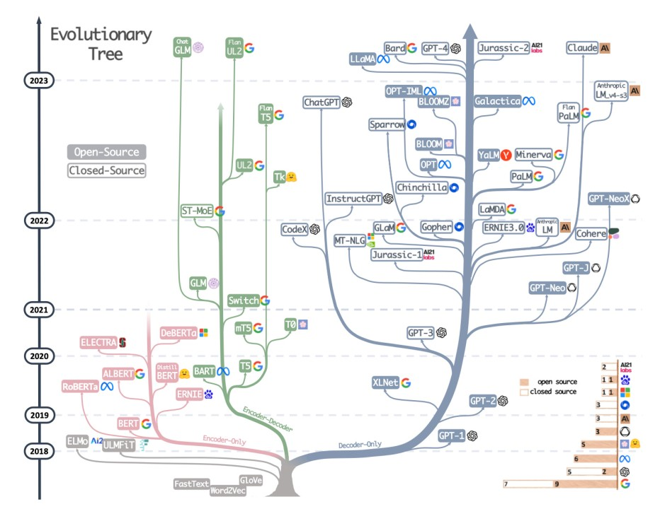

# Notable Text-based AI Models Released After GPT-4o

<figure markdown="span">
  { loading=lazy }
  <figcaption>The Evolution of LLMs - Retrieved from <a href="https://www.linkedin.com/pulse/constructing-large-language-models-comprehensive-endeavor-singh" target="_blank" rel="noopener">Jasvinder Singh's linkedin</a> </figcaption>
</figure>

## 1. Claude 3.5 Sonnet (Anthropic, June 21, 2024)

This model outperforms its predecessor, Claude 3 Opus, in speed and efficiency, achieving better results at a fraction of the cost. It sets new benchmarks in various evaluations, including graduate-level reasoning and coding proficiency, and is noted for its strong vision capabilities in interpreting visual data.

## 2. Mixtral Large 2 (Mistral, July 2024)
A large language model designed for versatility across various AI tasks, Mixtral is notable for its open-source availability and aims to compete with other leading models in performance and efficiency.

## 3. Llama 3 (Meta, July 2024)

Meta's latest iteration, Llama 3.1, surpasses its predecessors with remarkable advancements in language understanding and generation. This model demonstrates enhanced capabilities in multilingual processing, complex reasoning, and creative tasks.

## 4. Grok 2 (xAI, August 2024)

Developed by Elon Musk's xAI, Grok 2 is an advanced conversational AI model that focuses on enhancing user interaction and understanding, aiming to provide more contextually relevant responses in dialogue. Notable for its exceptional speed, Grok 2 delivers near-instantaneous responses, significantly reducing latency in real-time conversations.

## 5. OpenAI Strawberry (Expected Autumn 2024)

OpenAI's forthcoming "Strawberry" model promises to be a game-changer in artificial intelligence. Here's what makes it special:

- Clever problem-solving: Tackles tricky maths problems, devises smart strategies, and even cracks complex word puzzles.
- Self-improvement: Learns from its own experiences, getting better at solving new challenges on its own.
- Top marks: Performed brilliantly in tough tests, outshining previous AI models by a wide margin.
- Coming to ChatGPT: Plans are underway to make Strawberry's clever thinking available to everyone through the popular ChatGPT service interface.

As of 12th September, 2024, OpenAI release its "Strawberry", [OpenAI o1](blog.md#openais-latest-model-o1s-capabilities-sep-2024). 