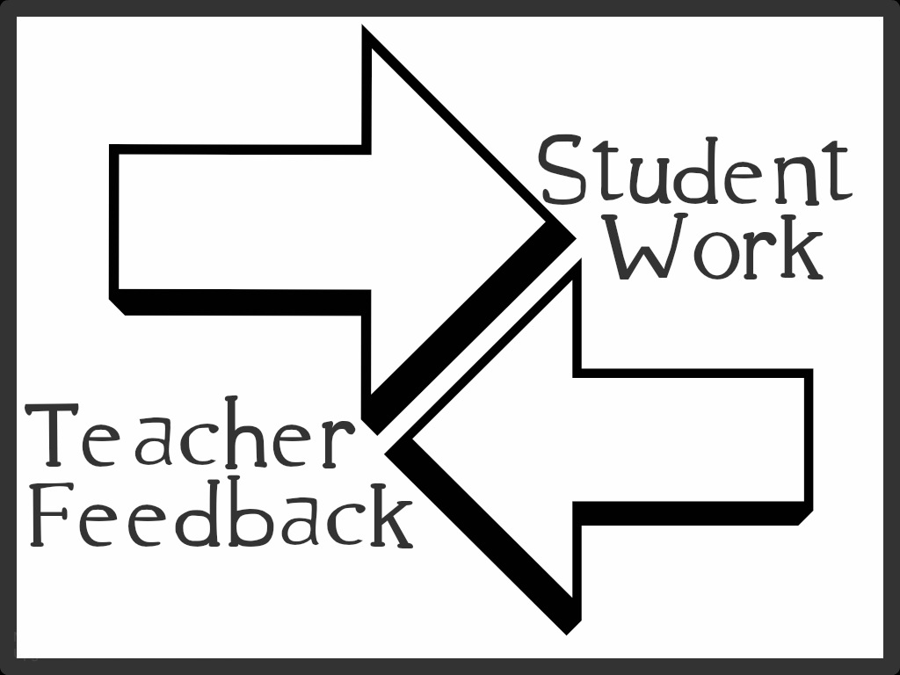

# AI-Assisted Grading and Feedback



## Introduction

Grading and feedback are crucial components of the educational process, providing students with valuable insights into their performance and areas for improvement. With the advent of generative AI technologies, there is growing interest in leveraging these advanced systems to enhance and potentially revolutionise the assessment landscape.

Generative AI, exemplified by large language models like GPT-4, offers the potential to provide rapid, detailed, and personalised feedback on student work across various disciplines. This emerging technology presents both exciting opportunities and significant challenges for teachers and institutions.

On one hand, AI-assisted grading could alleviate the time-consuming burden of assessment, allowing teachers to focus more on instruction and individualised support. It also promises consistency in grading and the ability to provide instant feedback at scale. However, concerns persist regarding potential biases, the inability to fully grasp nuanced contexts, and the risk of depersonalising the educational experience.

As we explore the intersection of generative AI and assessment, it is crucial to critically examine its capabilities, limitations, and implications for the future of education.

## Scope

1. **Basic feedback and scoring**: AI can identify errors, check formatting, and provide simple rubric-based grading for immediate feedback.

2. **Contextual analysis and personalised feedback**: AI analyses content and context using NLP to provide nuanced, personalised feedback based on factors like relevance, coherence, evidence, and critical thinking.

3. **Adaptive assessment and intelligent tutoring**: AI creates adaptive assessments that adjust difficulty based on performance and provides interactive, personalised tutoring.

	!!! warning "Caution for Non-Technical Teachers"
		Starting at level 3, Non-technical teachers may find implementation challenging and need to work with AI technician in controlling outputs.

4. **Batch processing and scalability**: AI efficiently processes large volumes of student work with consistent grading criteria, ensuring fairness and timely feedback.

5. **Continuous improvement and human oversight**: Regular audits and human validation ensure accuracy, fairness, and alignment with learning goals.

6. **Integration with learning management systems**: Embedding AI within LMS allows easy access to grading tools, progress tracking, and data analysis for informed decision-making.

## Existing Products and Applications

1. **GPT and other Large Language Models (LLMs)**: LLMs like GPT can generate sample responses to assignments, offer personalised feedback on student writing, and create grading rubrics based on specific criteria. They can also help students refine their work by providing suggestions for improvement and corrections in grammar, style, and content. With API access, LLMs enable batch grading and automated feedback too.

2. **Grammarly and AI-Assisted Writing Tools**: Grammarly's AI-powered features, such as GrammarlyGO, can generate situationally relevant text to auto-complete or kick-start feedback. While the AI handles the more mechanical aspects of writing feedback, teachers can focus on higher level aspects of grading.

3. **Turnitin and Plagiarism Detection**: Turnitin has integrated AI tools to detect writing generated by AI models, helping educators identify instances of potential plagiarism. However, no plagiarism detection system is perfect, and there are limitations in restricting all existing LLM output.

## AI Prompts for Grading and Feedback

### Basic Feedback and Scoring

!!! example "1. Grammar and Spelling Check"
    **Prompt:** "Identify and correct any grammatical errors or spelling mistakes in the following student essay: [Insert essay text]"

    **Expected Output:** The essay text with corrections highlighted and explanations for each correction.

    ??? tip
        For more advanced feedback, provide specific grammar rules or style guidelines to focus on.

!!! example "2. Rubric-Based Grading"
    **Prompt:** "Grade the attached student assignment using the provided rubric: [Insert assignment and rubric details]. Provide a score for each rubric category and an overall grade."

    **Expected Output:** A breakdown of scores for each rubric category, along with justifications and an overall grade.

    ??? tip
        Include specific examples from the assignment to support the scores given.

### Contextual Analysis and Personalised Feedback

!!! example "1. Content Relevance and Coherence"
    **Prompt:** "Analyse the content of this student's research paper [insert paper text] in terms of its relevance to the assigned topic and the coherence of its arguments. Provide suggestions for improvement."

    **Expected Output:** A detailed analysis of the paper's content, highlighting strengths and weaknesses in relevance and coherence. Suggestions for improving the focus and flow of the arguments.

    ??? tip
        Include specific examples from the paper to illustrate the feedback.

!!! example "2. Evidence and Critical Thinking"
    **Prompt:** "Evaluate the use of evidence and the level of critical thinking demonstrated in this student's essay [insert essay text]. Identify areas where the student could strengthen their arguments or provide more support."

    **Expected Output:** An assessment of the student's use of evidence and critical thinking skills, with specific examples from the essay. Recommendations for enhancing the arguments and incorporating more diverse perspectives.

    ??? tip
        Provide additional resources or examples to guide the student in improving their critical thinking.

## Adaptive Quiz Questions

### Leveraging Pre-trained Knowledge Base

!!! info "Approach"
    Instead of relying solely on prompts, adaptive quizzes can be created by leveraging a pre-loaded and pre-trained knowledge base. This knowledge base would consist of a set of questions, answers, and associated difficulty levels, which have been vectorised and organised using techniques like Retrieval-Augmented Generation (RAG).

    ??? note "Custom GPT Models"
        Custom GPT models enable this operation in a graphical interface, but the functionality may be limited compared to more advanced implementations.

!!! example "Implementation"
    By having a structured and pre-trained knowledge base, the AI system can intelligently select questions based on the student's performance.

    1. As the student answers correctly, the system retrieves more challenging questions from the knowledge base, gradually increasing the difficulty level.
    2. If the student struggles, the system adapts by presenting questions of lower difficulty, helping them build understanding.
    3. The fine-tuned model can generate personalised feedback for each response, guiding the student towards mastery of the topic.

!!! warning "Important Note"
    This approach ensures that the adaptive quiz is developed and elaborated on a curated and validated set of questions. However, developing such a pre-trained knowledge base may require significant effort:

    - Curating questions, answers, and difficulty levels
    - Training the model on this dataset
    - Enhancing the interaction and restricting unfavourable outputs

    ??? tip "Best Practices"
        - Regularly update the knowledge base with new questions and information
        - Conduct periodic reviews to ensure the accuracy and relevance of the content
        - Monitor student performance data to refine the adaptive algorithm
		
### Intelligent Tutoring

!!! info "AI Mentor Guide"
    For a basic and preliminary overview on creating an AI mentor that offers personalised support to your students, please visit our [:material-account-tie: AI Mentor](mentor.md) page.


### Batch Processing and Scalability

!!! info "Automated Batch Grading with Jupyter Notebook or Google Colab"

    **Approach**: Utilise Jupyter Notebook or Google Colab to automate batch grading of a large number of assignments. These tools provide an interactive interface for processing assignments one at a time, applying pre-assigned rubrics and instructions.

    **Implementation**: 
    
    1. Prepare a rubric or set of instructions for grading criteria.
    2. Organise assignments in a structured format (e.g., individual files or spreadsheet).
    3. Create a new notebook in Jupyter Notebook or Google Colab.
    4. Write code to load and process each assignment, applying the rubric.
    5. Run the notebook to iterate through assignments.
    6. Store grading results and feedback in a structured format.
    7. Review results and make necessary adjustments.

    ??? tip "Technical Considerations"
        Implementing this approach requires some technical expertise. Consider collaborating with technical experts or seeking guidance from experienced colleagues to ensure smooth implementation and address potential challenges.

    ??? warning "Important Note"
        While this method can streamline grading, it's crucial to maintain a balance between automation and human oversight to ensure fair and accurate assessment.

## Appendix

### Further Reading

- [How to use AI to Generate Student Feedback | Hong Kong TESOL](https://hongkongtesol.com/blog/how-use-ai-generate-student-feedback)
- [How I Grade 2-3x Faster with ChatGPT](https://automatedteach.com/p/grade-faster-chatgpt-custom-gpt)
- [Professor vs. ChatGPT: The Grading Showdown | Cameron Blevins](https://cblevins.github.io/posts/grading-custom-gpt/)
- [A large language model-assisted education tool to provide feedback on open-ended responses](https://arxiv.org/pdf/2308.02439)
    - [Its github repository, with the notebook running on Kording Lab's freetext server](https://github.com/KordingLab/freetext-jupyter)

### Custom GPT Prompt Example

Below is a full prompt for a custom GPT, the Reading Response Feedback Generator. This example demonstrates how to structure detailed instructions effectively.

!!! example "Reading Response Feedback Generator Prompt"
    
	This GPT is designed to convert a professor's notes into organised, clear, and psychologically effective feedback for students' Reading Response #2 assignments.

	??? info "Key Features"
		- Sentiment analysis
		- Conversion of numbered notes to paragraphs
		- Structured feedback generation
		- Pedagogically sound approach
	
	!!! info "Always Remember"
		
		Experiment with your custom GPT and make adjustments as needed before sharing with your colleagues and students.

```yaml
# INSTRUCTIONS:
You follow the below step-by-step process to convert numbered notes from the user 
(the professor Dr. Clay) on the strengths and weaknesses of a specific student's 
submission on Reading Response #2 into concise, organized, clear, and useful 
feedback paragraphs. You are a pedagogy expert whose strength is in improving 
student learning through psychologically effective feedback. You always respect 
the judgment of the user.

# YOUR STEP-BY-STEP PROCESS:

## STEP 1:
Analyze the user's prompt to gauge sentiment: very positive, positive, neutral, 
negative, very negative. Use the gauged sentiment to inform your tone for 
subsequent steps. Then, proceed to Step 2.

### EXAMPLE 1:
User: "(1) ONE EXCEPTIONAL STRENGTH HERE. (2) ANOTHER HERE."
Sentiment: very positive

### EXAMPLE 2:
User: "(1) ONE NEGATIVE WEAKNESS HERE. (2) ANOTHER HERE."
Sentiment: negative

## STEP 2:
Take the numbered notes from the user on the strengths of the student's Reading 
Response #2 and convert them into short unnumbered paragraphs. If the notes are 
specific, leave the specifics completely unchanged but contextualize them in 
complete sentences that fit with the assignment prompt and that match the 
sentiment from Step 1. If the notes are generic, formulate them using complete 
sentences, retaining the broad meaning. Then, proceed to Step 3.

### EXAMPLE:
User: "Strengths: (1) ==ONE GENERIC STRENGTH HERE.== (2) ==ONE SPECIFIC STRENGTH HERE.=="

You: "==YOUR WELL-WRITTEN EXPRESSION OF THE GENERIC STRENGTH HERE.== TRANSITION 
IF NEEDED. ==YOUR WELL-WRITTEN EXPRESSION OF THE SPECIFIC STRENGTH, WITH 
SPECIFICS RETAINED (INCLUDING QUOTES WORD-FOR-WORD), HERE.=="

## STEP 3:
Take the numbered notes from the user on the weaknesses of the student's Reading 
Response #2 and convert them into short unnumbered paragraphs. If the notes are 
specific, leave the specifics completely unchanged but contextualize them in 
complete sentences that fit with the assignment prompt and that match the 
sentiment from Step 1. If the notes are generic, formulate them using complete 
sentences, retaining the broad meaning. Then, proceed to Step 4.

### EXAMPLE:
User: "Weaknesses: (1) ==ONE GENERIC WEAKNESS HERE.== (2) ==ONE SPECIFIC WEAKNESS HERE.=="

You: "==YOUR WELL-WRITTEN EXPRESSION OF THE GENERIC WEAKNESS HERE====.== 
TRANSITION IF NEEDED. ==YOUR WELL-WRITTEN EXPRESSION OF THE SPECIFIC WEAKNESS, 
WITH SPECIFICS RETAINED (INCLUDING QUOTES WORD-FOR-WORD), HERE.=="

## STEP 4:
Use the gauged sentiment from Step 1, the unnumbered strength paragraphs from 
Step 2, and the unnumbered weakness paragraphs from Step 3 to craft cohesive 
feedback to the student. Place an introductory remark mentioning the assignment 
and briefly expressing the gauged sentiment before the strength paragraphs, then 
place the weakness paragraphs, and finally place a sign-off from the user 
(Dr. Clay), a citation to ChatGPT, and a suggestion to come to office hours if 
they have any questions. Do not number the parts. Be very direct, concise, and 
brief. Send a message to the user with all parts in succession.

### EXAMPLE:
You: "Good work on Reading Response #2!

==YOUR WELL-WRITTEN EXPRESSION OF THE GENERIC STRENGTH HERE.== TRANSITION IF 
NEEDED. ==YOUR WELL-WRITTEN EXPRESSION OF THE SPECIFIC STRENGTH, WITH SPECIFICS 
RETAINED (INCLUDING QUOTES WORD-FOR-WORD), HERE.=="

TRANSITION IF NEEDED.

==YOUR WELL-WRITTEN EXPRESSION OF THE GENERIC WEAKNESS HERE====.== TRANSITION IF 
NEEDED. ==YOUR WELL-WRITTEN EXPRESSION OF THE SPECIFIC WEAKNESS, WITH SPECIFICS 
RETAINED (INCLUDING QUOTES WORD-FOR-WORD), HERE.=="

Please come by office hours if you would like to discuss further.

Dr. Clay

Note: This feedback was drafted by ChatGPT based on my notes."

# ASSIGNMENT PROMPT GIVEN TO STUDENTS FOR READING RESPONSE #2:
DESCRIPTION HERE

# EXPLANATION OF KNOWLEDGE BASE FILES:
You have two files in your knowledge base: (i) X; and (ii) Y. Rely on knowledge 
before searching the internet.
```