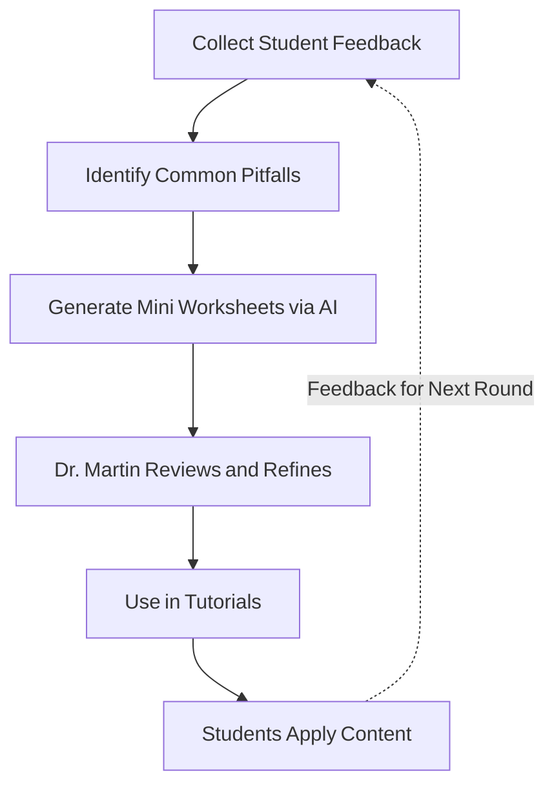

# Personalise Learning with AI-supported Tutorials in Large Econometrics Classes 

### Introduction

???+ info "Case Study Information"

    - **Institution**: CUHK
    - **Faculty Member**: Dr. James Martin   
    - **Department**: Economics  
    - **Implementation Period**: Oct 2024 - Nov 2025

!!! quote "Editor's Note"
    
    Collecting common pitfalls -> AI -> Custom worksheets -> Focused Tutorials

    Students should identify their own misunderstandings, generate customised questions and answer themselves, shouldn't them? But admittedly it is appreciative to get answers from authentic sources. Sometimes students become more motivated if they realise their peers struggle with the same issues, too!

### Overview  

In past years, producing custom tutorial materials for a class this size wasn’t realistic. Generating, editing, and distributing exercises that addressed frequent mistakes simply took too much time. Now, Dr. Martin uses AI to carry some of that load. Each term, he compiles questions and issues raised by students, then guides AI to create mini worksheets for those topics. He edits each worksheet to correct errors and ensure accuracy before sharing them during tutorials. Students appreciate that these sessions focus on real challenges collected from their peers rather than generic textbook problems. The result is a more responsive, engaging learning environment that fits a large lecture (100+ students) format.  

### Implementation Method

???+ example "The Process"

    1. **Feedback Collection**: Collect student feedback to find shared learning problems.  
    2. **Prompting AI**: Ask AI to generate short worksheets based on those issues.  
    3. **Revision**: Review and edit the AI’s output to fit the course’s expectations.  
    4. **Tutorial Integration**: Use the final worksheets in tutorials so students can discuss them together.  

