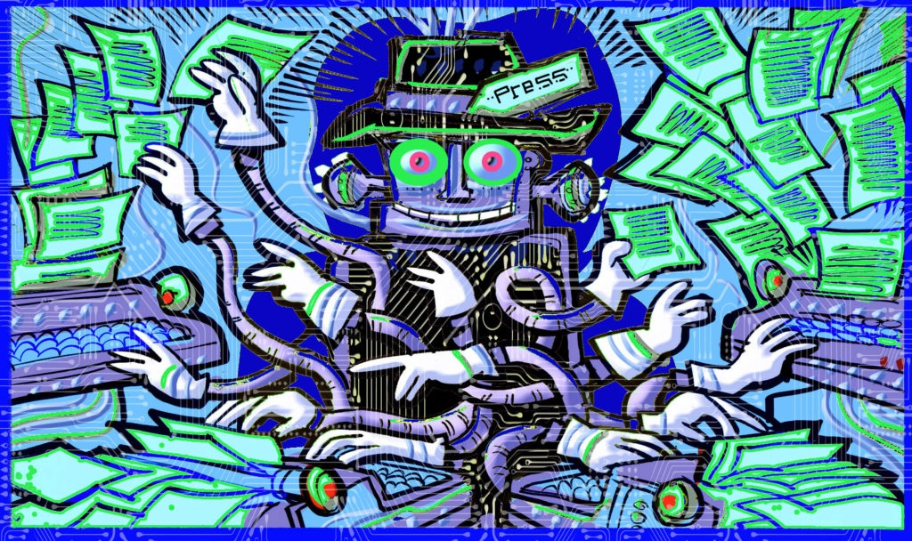

## Introduction

The integration of Generative AI in journalism and communication education marks a transformative era, reshaping how future media professionals are trained. As newsrooms increasingly adopt AI technologies, with a recent survey by the World Association of News Publishers indicating that [half of all newsrooms now use Generative AI tools](https://wan-ifra.org/2023/05/new-genai-survey/), the educational landscape is rapidly evolving to meet these new demands.

This shift presents both exciting opportunities and complex challenges for educators and students alike. Generative AI offers potential to enhance storytelling techniques, streamline research processes, and develop innovative forms of audience engagement. However, it also raises critical questions about maintaining journalistic integrity, fact-checking AI-generated content, and preserving the human elements essential to effective communication.

## Potential AI Applications in Teaching and Learning

- **Automated Transcription and Analysis**: Employ AI tools like Otter.ai to not only transcribe interviews but also to analyse speech patterns, emotional tones, and key themes. This trains students in nuanced interpretation of source material beyond just the words spoken.
- **AI Image Generators**: Incorporating tools like Meta's Grok 2 and OpenAI's DALL-E 3 to train students in creating ethical visual content for stories where traditional photography isn't possible, whilst emphasising the importance of proper labelling.
- **AI-Enhanced Research Assistants**: Utilising platforms like Perplexity.ai to teach students advanced information searching and investigative journalism techniques. These tools help aspiring journalists efficiently navigate and synthesise large volumes of online data, enhancing their ability to uncover and report complex stories.
- **AI-Assisted Fact-Checking Workshops**: Integrate tools like Chequeado's Chequeabot into practical workshops where students learn to cross-reference AI-generated fact-checks with traditional methods, developing a critical approach to both AI and human fact-checking processes.
- **AI Writing Assistants**: Integrating tools like Writesonic, Notion AI, and Text Blaze to teach students about content optimisation, alternative phrasing, and SEO techniques.

## Practical Cases of AI Application

### 1. Generative AI-Assisted Reporting at Hong Kong Baptist University

#### Description
Hong Kong Baptist University has launched a groundbreaking [undergraduate Generative AI-Assisted Reporting class](https://www.linkedin.com/pulse/teaching-generative-ai-journalism-genz-one-revolution-jarrod-watt-k07ne), marking a significant shift in journalism education. This innovative course explores a wide range of AI tools and their applications in journalism, combining theoretical discussions with practical insights from industry professionals.

A key feature of the course is the weekly "What just happened" sessions. These sessions, held at the beginning of each class, are designed to keep students abreast of the rapidly evolving AI landscape in journalism. Students and instructors discuss and analyse the latest developments in AI and media that have occurred in the past week, ensuring the curriculum remains current and relevant.

The course covers various aspects of AI in journalism:

- Voice cloning technology: While students don't directly experiment with voice cloning, they gain insights from guest speaker Hailey Yip, a journalist who has implemented voice cloning in daily radio production for RTHK News in Hong Kong. This allows students to understand the practical applications and ethical implications of such technology.
- Emerging text-to-video generators: The class examines cutting-edge technologies like OpenAI's Sora, discussing their potential impact on visual storytelling in journalism. Although students can't test Sora directly due to its limited public availability, they engage in critical discussions about its implications for the future of media production.
- AI-powered research tools: Students actively use platforms like ChatPDF to summarise research papers and refine interview questions using ChatGPT, gaining practical skills in AI-assisted research and content preparation.
- AI transcription tools: The course incorporates practical use of Otter.ai for transcription, allowing students to assess its accuracy across various accents and languages, preparing them for real-world application of such tools.

#### Testimonies
Jarrod Watt, Visiting Senior Lecturer at the Department of Journalism, reflects on the rapid pace of change: 
> "I remember a decade ago being told by a mentor that being a digital journalist meant throwing out everything you thought you knew every three to five years: these days, we start each week's class with a section titled 'What just happened' to recap each development we've seen flying past in one of our newsfeeds in the past seven days."

#### Effects/Interpretation
This innovative approach to journalism education balances theoretical knowledge with practical insights, preparing students for the rapidly evolving media landscape.

### 2. Paul Bradshaw's Approach to Teaching Generative AI in Journalism

#### Description
Paul Bradshaw, an award-winning data journalist and academic running the MA in Data Journalism at Birmingham City University, has outlined a [comprehensive approach](https://onlinejournalismblog.com/2023/07/03/this-is-how-ill-be-teaching-journalism-students-chatgpt-and-generative-ai-next-semester/) to incorporating generative AI into journalism education. His method prioritises understanding how AI works, ethical use, and practical applications in journalistic tasks, structured around nine key priorities:

1. Understand how generative AI works: Addressing misconceptions about AI functionality, biases, and limitations.
2. Know how to attribute the use of ChatGPT: Emphasising proper attribution and ethical use of AI-generated content.
3. Using ChatGPT for editorial feedback: Leveraging AI tools to improve writing and understand different editorial styles.
4. Know how to write effective and ethical prompts: Teaching students to craft prompts for various journalistic tasks.
5. Idea and source generation: Using AI to generate story ideas and identify diverse sources.
6. Technical support: Utilising AI for coding assistance, spreadsheet formulas, and data scraping.
7. Background briefings: Using AI to gather initial background information on complex topics.
8. Filtering and prioritising: Applying AI to extract newsworthy information from documents and datasets.
9. Automation of writing: Exploring AI's potential in automating certain aspects of writing, while stressing human oversight.

#### Testimonies  
Paul Bradshaw states: 
> "Asking journalism students not to use ChatGPT is like asking students not to have sex: many will have already done it, and they're going to be much more interested in explanations on how to do it well than in admonitions not to do it at all."

#### Effects/Interpretation 
This approach aims to prepare journalism students for the practical use of AI while equipping them with critical skills to navigate ethical and factual challenges.

## Other Examples
- AI-powered news writing: Some news organisations are using AI to generate routine news stories, such as financial reports or sports recaps, allowing journalists to focus on more complex stories.
- AI-enhanced data journalism: Tools that can analyse large datasets and identify newsworthy trends or anomalies, supporting data-driven reporting.
- Personalised news recommendation systems: AI algorithms that curate news content based on individual reader preferences and behaviours.
- AI-assisted video and audio editing: Tools that can automatically transcribe, caption, and even edit video and audio content, streamlining the production process.
- Sentiment analysis for public opinion: AI tools that can analyse social media and other online content to gauge public sentiment on various topics.
- AI-powered content moderation: Systems that help manage user-generated content and comments on news websites, identifying potentially problematic posts.

## Further Reading
- [AI in journalism is here. Now what? Educators debate how to ask and verify the answer. – Gateway Journalism Review](https://gatewayjr.org/ai-in-journalism-is-here-now-what-educators-debate-how-to-ask-and-verify-the-answer/)
- [Generative AI in the Newsroom](https://generative-ai-newsroom.com/)
