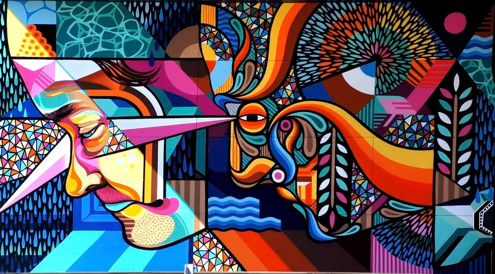

# Multimodality - Any-to-Any Generation

## Introduction

Multimodal AI models offer significant potential in education by enabling any-to-any generation, allowing for diverse input and output formats. This capability can revolutionise how educational content is created, consumed, and managed.

We've seen the emergence of various AI-powered educational tools, such as [virtual characters](virtual-character.md) for interactive learning, [adaptive learning](palearning.md) platforms, [AI avatars and voice cloning](aivideo.md) for customisable videos, and [semantic search engines](search-engine.md) for efficient information retrieval. However, the possibilities extend far beyond these applications.

In education, multimodal AI models can generate dynamic, engaging materials catering to diverse learning styles, allowing both teachers and students to access and create information tailored to their preferences and needs.

## Output Generation

### Dynamic Learning Materials

- Images: Dall-E 3 for making visual learning aids
- Slides: SlideAI for turning text/documents into visually appealing slides
- Video Summaries: Eightify for creating textual summaries from Youtube video content with time stamps and highlight
- Podcasts: Alitu for making podcasts, Suno AI for AI-generated music
- Animations: Synthesia for creating AI-powered educational videos
- Quizzes and Assessments: Quizlet's magic notes for quizzing users on uploaded articles

### Industry-Standard Outputs

- Code Generation: GitHub Copilot suggests code snippets and functions, helping students learn programming in real-world development environments
- UI Design: Galileo AI generates UI designs directly editable in Figma, allowing students to learn and practice real-world design workflows
- VFX and 3D Animation: Wonder Dynamics creates AI-powered VFX and animations editable in Blender, enabling students to gain hands-on experience with professional tools

## Input Processing

### Knowledge Integration

- Enable teachers to upload and integrate knowledge from various sources: past slides and presentations, conference recordings, recording lectures, textbooks and academic paper...

### Specialised Input Processing

- Video retrieval: Twelve Labs can search any specific scene within vast video libraries using natural language queries and generate relevant texts like summaries or chapter breakdowns
- File Retrieval: Microsoft 365 Copilot for searching the contents of your documents in cloud storage, providing a concise summary of the searched content, and facilitating easy retrieval of information across all uploaded content
- Transcription: Whisper for transcribing and analysing spoken content in multiple languages

### Multimodal Online Search and Retrieval

- Perform cross-modal searches, such as finding relevant images for a text query or locating video segments based on a concept description
- Example: CLIP (Contrastive Language-Image Pre-training) by OpenAI enables searching images using natural language

## Final Remarks

The integration of multimodal AI in education represents a paradigm shift in how we create, consume, and interact with educational content. By leveraging the power of any-to-any generation, these AI models are breaking down barriers between different forms of media and learning styles. This transformation not only enhances the learning experience for students but also empowers teachers with powerful tools for content creation and knowledge management.

