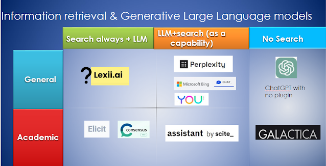
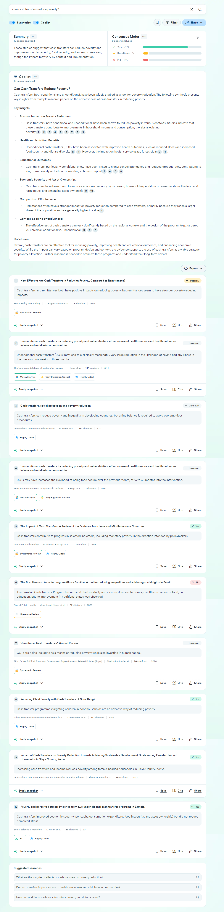
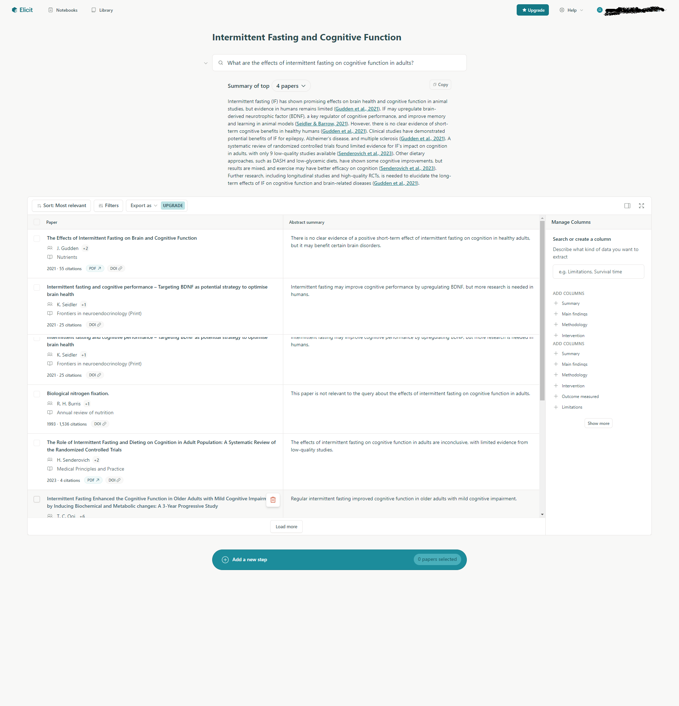

# AI-Powered Search Engines

<figure markdown="span">
  { loading=lazy }
  <figcaption>A chart on current ways of retrieving information online with or without LLMs - Retrieved from <a href="https://musingsaboutlibrarianship.blogspot.com/2023/04/41-different-ways-large-language-models.html" target="_blank" rel="noopener">Aaron Tay's blog</a> </figcaption>
</figure>

## Introduction

AI-powered search engines are advanced tools that use artificial intelligence to understand and respond to user queries more effectively than traditional search engines. Instead of just matching keywords, these systems can interpret the meaning behind questions, analyse vast amounts of information, and provide direct, relevant answers.

Think of them as super-smart digital assistants. They can quickly sift through enormous amounts of information - from websites, academic papers, and databases - to find the most relevant and up-to-date answers to your questions. They're designed to understand natural language, so you can ask questions as you would to a human expert, and often receive more precise and tailored responses.

## Notable Examples

Below are three notable examples, each with its own distinct focus (screenshots are captured directly on their interfaces):

### 1. Perplexity

{ loading=lazy }

[Perplexity](https://www.perplexity.ai/) is a general-purpose AI search engine designed for everyday use across a wide range of topics. Students can use Perplexity for quick research on diverse topics. Its conversational nature allows for exploratory learning, while source citations encourage fact-checking.

- Suitable for general knowledge queries and current events
- Real-time information updates from current web sources
- Provides concise, direct answers to queries in natural language
- Conversational interface allowing for follow-up questions

### 2. Consensus

{ loading=lazy }

[Consensus](https://consensus.app/) is specialised for scientific research, focusing on providing an overview of scientific consensus on various topics. Researchers and students in scientific fields can use Consensus to quickly grasp the current state of knowledge on a topic, identify major trends, and understand where scientific consensus lies on controversial issues.

- Exclusively searches peer-reviewed scientific literature
- Focuses on presenting aggregate findings rather than individual papers
- Provides visualisations of research trends and data
- Reduces the likelihood of misinformation under a meticulous validation process

### 3. Elicit

{ loading=lazy }

[Elicit](https://elicit.com/) is an AI research assistant tailored for in-depth academic research, particularly in empirical fields. Graduate students and researchers can use Elicit to conduct comprehensive literature reviews, quickly identify relevant methodologies, and extract specific data points from large volumes of academic papers.

- Searches across over 126 million academic papers from the Semantic Scholar corpus across all academic disciplines
- Extracts specific information from papers (e.g., sample sizes, methodologies)
- Generates a customisable literature review table based on user-defined criteria, allowing researchers to compare and analyze multiple papers efficiently

## Final Remarks

It's crucial to note that while these tools are powerful aids in research and learning, they should be used critically. Users should verify the information provided, as no AI system is 100% accurate. These tools are best used as assistants to augment human research and decision-making processes, not as definitive sources of truth.
