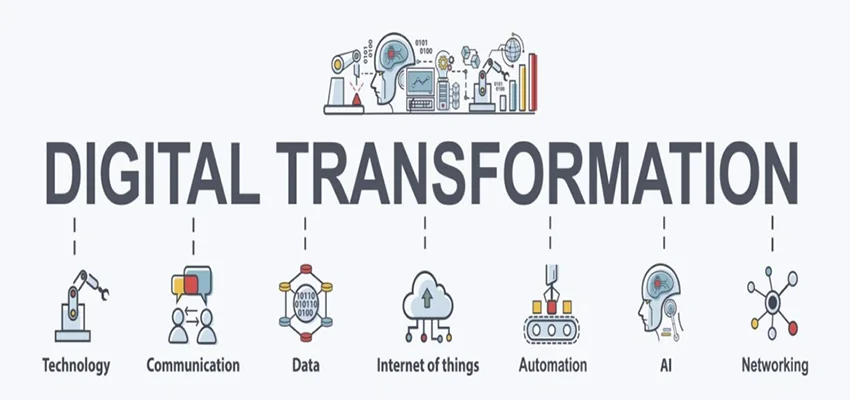

# Sociology

## Introduction

Sociology, as a discipline dedicated to studying social structures, relationships, and behaviours, is increasingly exploring the integration of artificial intelligence (AI) in its practice and education. The field recognises AI's potential to enhance sociologists' capabilities in areas such as data analysis, social research, and theoretical modelling. However, it also grapples with ethical considerations surrounding AI use, particularly in maintaining the critical thinking and human-centered approach that is fundamental to sociology. As the profession evolves, sociology education is adapting to prepare future practitioners for an AI-integrated landscape while emphasising the irreplaceable nature of human insight and professional judgment.

## Potential AI Applications in Teaching and Learning

- **AI-Enhanced Curriculum Development**: Educators use AI to assist in developing comprehensive, up-to-date sociology curricula. By inputting key sociological concepts, current events, and learning objectives, teachers can generate diverse lesson plans and course assignments.
- **Cultural Narrative Deconstruction**: AI generates social narratives from different cultural perspectives, which students then deconstruct to understand diverse societal viewpoints.
- **AI-Assisted Literature Review**: Students use AI to help gather, summarise, and analyse existing sociological literature on specific topics. This tool can help students quickly identify key themes, methodologies, and gaps in current research, allowing them to develop more comprehensive and well-informed research proposals or papers.
- **Comparative Methodology Generator**: AI creates multiple research designs for a given sociological question, allowing students to critically evaluate and refine methodological approaches.
- **Reflexive Dialogue Analysis**: Students engage in conversations with AI about sociological concepts, then analyse the dialogue to uncover hidden biases and assumptions in both human and AI responses.

## Practical Cases of AI Application

### 1. Using ChatGPT for Creating Authentic Sociology Assignments

#### Description

David Woodring, a criminologist and educator, integrated ChatGPT into his sociology courses to create authentic and personalised assignments. By crafting specific prompts:

- Woodring aligned teaching philosophy with ChatGPT that emphasises collaborative intelligence and real-world problem-solving.
- Woodring created a multi-step, problem-based assignment simulating a real-world research study with ChatGPT. This included mock data creation, simulation of real-world research scenarios, peer-review and self-reflection components.
- Woodring also used ChatGPT to tailor assignments to diverse learning styles and backgrounds, ensuring cultural responsiveness and equity.

#### Testimonies

Woodring noted, 
> "I was amazed as I watched the most powerful teaching/learning activity I had ever created simulate the research process for students."

#### Effects/Interpretation

ChatGPT helped simulate real-world research scenarios, providing students with practical skills. The process also ensured cultural responsiveness and equity, demonstrating AI's potential to enhance education without becoming a crutch.

### 2. Utilising ChatGPT for Critical Analysis in Sociology

#### Description

Taylor Price integrated ChatGPT into a "Sociology of Culture" course to foster critical thinking and analysis. Students created research proposals using ChatGPT and evaluated its responses:

- Students used ChatGPT to generate proposals on the social origins of musical subgenres.
- They assessed the AI's work, providing feedback on the accuracy and relevance of its outputs.

#### Testimonies

Price stated, 
> "classrooms should be adapted to accommodate the social world, not the other way around."

#### Effects/Interpretation

The assignment showed that ChatGPT could produce strong research proposals, but it required students to engage critically and thoughtfully with the content. The grade distribution remained consistent with other assignments, indicating that AI can be integrated without compromising educational standards.

### 3. Exploring AI Ethics and Reflexivity through ChatGPT Conversations

#### Description

Andrew Balmer, a sociologist at Manchester University, engaged in a conversation with ChatGPT to explore AI ethics, affect, and reflexivity in knowledge production:

- Balmer conducted a real-time dialogue with ChatGPT, discussing its creation, sociological understanding, and the experience of making knowledge with AI.
- The conversation touched on topics such as AI's emotional expressions, scientific objectivity, and the cultural embeddedness of AI technologies.

#### Testimonies 

Balmer described the interaction as 
> "a playful sociological provocation, to think what might be required of us, as academics, as we begin to live and work alongside artificial intelligences."

#### Effects/Interpretation

This experimental approach highlighted the need for critical reflection on AI's role in academic work. It demonstrated how AI can be used as both a subject and tool for sociological inquiry, prompting discussions about the affective, ethical, and political dimensions of AI in knowledge production. The conversation also revealed the potential for AI to engage in meta-level discussions about its own nature and impact on academic disciplines.

### Other Examples

- Social Network Analysis Tools: AI-driven tools for visualising and interpreting complex social structures and relationships, helping sociology students better understand social network dynamics.
- Gamified Learning Experiences: Using AI to teach complex sociological concepts and theories, increasing student engagement in sociology courses.
- Cross-cultural Communication Tools: Real-time translation and cultural sensitivity analysis, facilitating international sociological research and cross-cultural exchange.
- Social Policy Simulator: Utilising AI to simulate potential impacts of different social policies, helping students understand the complexity of policy-making in sociology.
- Ethical Decision-making Trainer: Training students to make decisions in complex sociological research ethics scenarios through AI-generated situations.

**Footnotes:**

1. Woodring, David (2023). "Beating ChatGPT with ChatGPT: Using AI Technology to Create Authentic Assignments.", [Norton Learning Blog](https://nortonlearningblog.com/archives/3762)
2. Price, Taylor (2024). ["I’m Not Afraid of ChatGPT in My Classroom.", University Affairs](https://universityaffairs.ca/career-advice/career-advice-article/im-not-afraid-of-chatgpt-in-my-classroom/)
3. Balmer, A. (2023). [A Sociological Conversation with ChatGPT about AI Ethics, Affect and Reflexivity. Sociology, 57(5), 1249-1258.](https://doi.org/10.1177/00380385231169676)