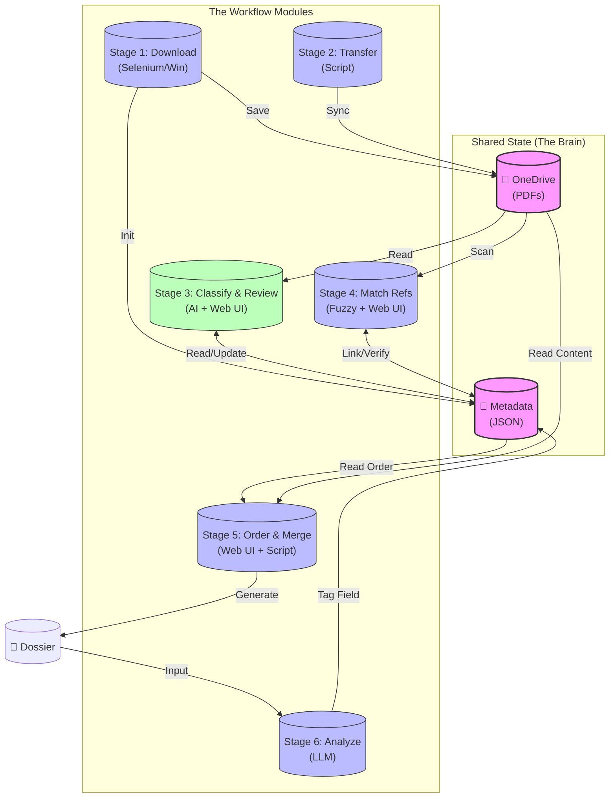

???+ info "Case Study Information"

    - **Project:** Taleo Attachment Downloader & Screener
    - **Stack:** Python, OneDrive, Qwen-VL (Cloud API), Deepseek-OCR (MLX)
    - **Context:** Hybrid Workflow (Office PC + Personal Mac)
    - **Status:** Experimental / "Vibe-Coded"
    - **Purpose:** Rapid Prototyping and Testing

!!! warning "Experimental Prototype"
    **Disclaimer:** This system is currently in an **experimental "vibe-coded" state**. It was built rapidly to solve an immediate problem and is **not** a mature, refactored software product.
    
    The code is messy, the refactoring is incomplete, and it is primarily designed for **testing and validation**. Use it as a reference for *what is possible* with local AI, not as a production-ready template.

!!! quote "Motivation: Why I Built This"
    This tool was born out of curiosity. The recruitment process involves hours of repetitive clicking on the office PC, which I believe staffs can automate this tedious process with the proper use of AI.
    
    I built this workflow to decouple the "downloading and merging" from the "thinking.". Ideally it can automate the whole process, but there were a few encountered issues: 2FA auth, looking for 100% classification accuracy and all files used, non-pdf files included, post-processing requirements (stage 5&6, e.g. splitting a file into two parts), and of course, the expected and unexpected performance of AI models. The manual review components help address the matters, but as of result, it is not that time-saving than I thought initially.
    
    By automating the file retrieval on the office Windows machine and syncing everything to my personal MacBook via OneDrive, I can also test and debug the workflow—reviewing candidates and organizing dossiers—at home/office, on my own schedule, using the tools I prefer.

## The Problem: Manual File Management

Recruitment drives involve thousands of applicants, creating a massive administrative burden. The core challenge is the sheer volume of manual "clicks" required to transform raw web data into a usable format for the hiring committee.

??? info "Detailed Pain Points"

    *   **Legacy Interface:** The web portal requires navigating multiple pages per candidate to access files.
    *   **File Chaos:** Attachments often download with generic names (e.g., `scan_001.pdf`), requiring manual inspection to identify if they are CVs or Transcripts.
    *   **Disconnected Sources:** Reference letters arrive via email, separate from the main application system.
    *   **Assembly Time:** Merging these disparate files into a single, clean PDF dossier is a slow, error-prone manual process.

## The Solution: A Distributed Pipeline

To understand this system, we must first define its mission as a data transformation problem. The solution is a chain of independent tools that share a "Digital Twin" (JSON) as their brain, allowing different stages to run on different operating systems without conflict.

??? info "System Logic & Architecture"
    
    ??? tip "The Mission: I/O Definition"

        *   **Input:** Messy, inconsistently named files from Taleo and scattered reference letters from emails.
        *   **Intermediate:** A **"Digital Twin"** (JSON) that tracks the identity and status of every document, independent of the files themselves.
        *   **Output:** A single, clean, bookmarked PDF dossier for each candidate.

    ??? note "Why Split into Stages?"
        By breaking the workflow into independent steps that only communicate via the "Digital Twin" (JSON), we gain flexibility. You can download new candidates (Stage 1) while simultaneously reviewing yesterday's batch (Stage 3). The workflow is **non-linear**: if you change your mind about how to classify a document, you simply update the JSON and re-run the merge step—no need to start over.

    ??? tip "The Power of Idempotence"
        The system is designed to be **idempotent** across the entire pipeline.
        
        Because the "Digital Twin" (JSON) tracks the state of every file, you can safely re-run any stage—or the whole pipeline—as many times as you like.
        
        *   **Stage 1 (Download):** Skips files that are already on OneDrive.
        *   **Stage 3 (Classify):** Skips candidates who are already classified.
        *   **Stage 5 (Merge):** Overwrites the previous PDF with the latest version.
        
        This means you don't need to worry about "corrupting" data by running a script "randomly" - either running a script twice (restore from checkpoint) or running scripts for downloading, classifying and reviewing in ANY orders won't break the script logic. Thus, you can safely decide when to perform a task and where to stop.

        An non-idemopotent pipeline,

???+ example "The Implementation Process"

    **Stage 1: The Collector (Windows)**
    This step handles the "Clicking Hell." It logs into the corporate portal (Taleo), detects new applicants, and downloads their raw attachments. It acts as the hands of the operation.

    **Stage 2: The Bridge (OneDrive)**
    This step securely moves the raw files across the "Air Gap"—from the corporate Windows environment to the AI-capable development environment.

    **Stage 3: The Sorter (AI + Web UI)**

    *   **AI Analysis:** A Vision Model (Qwen-VL) looks at the first page of every PDF to guess its type (e.g., "Is this a CV or a Transcript?").
    *   **Human Verification:** A **Web UI** displays the AI's guesses. The user simply clicks to correct any mistakes, updating the JSON "brain" instantly.

    **Stage 4: The Detective (Fuzzy Match + Web UI)**

    *   **Matching:** The system scans a folder of loose reference letters and uses fuzzy text matching to link them to the correct candidate.
    *   **Verification:** A **Web UI** presents the proposed matches for approval, ensuring no candidate gets the wrong recommendation letter.

    **Stage 5: The Publisher (Assembly)**
    Once the JSON confirms that all documents are present and correctly classified, this stage merges them into a single, professional PDF dossier with a table of contents.

    **Stage 6: The Analyst (LLM)**
    The final dossier is read by an LLM to determine the candidate's research field (e.g., "Macroeconomics"), sorting the file into the correct folder for the hiring committee.

## Outcomes & Reflections

*   **Speed:** The automation reduces hours of manual file management to hours of background processing. Users only need to perform the manual review process that cannot be automated.
*   **Resilience:** Because the system is state-based (JSON), crashes do not cause data loss. Restarting the script resumes the process from the last checkpoint. And users can run the workflow script at any stage because the workflow is designed to be idempotent.
*   **Flexibility:** The "Vibe Coding" approach allowed the tool to evolve daily. New requirementscould be addressed by adding new modules (Stage 7) without breaking the existing chain.

!!! warning "Reality Check: It's Not Production Software"
    This system is a "protoduction" tool—a prototype running in production. It relies on the user knowing how to run Python scripts and manage OneDrive sync conflicts. It serves as a powerful utility for technical users rather than a polished application for general staff.
