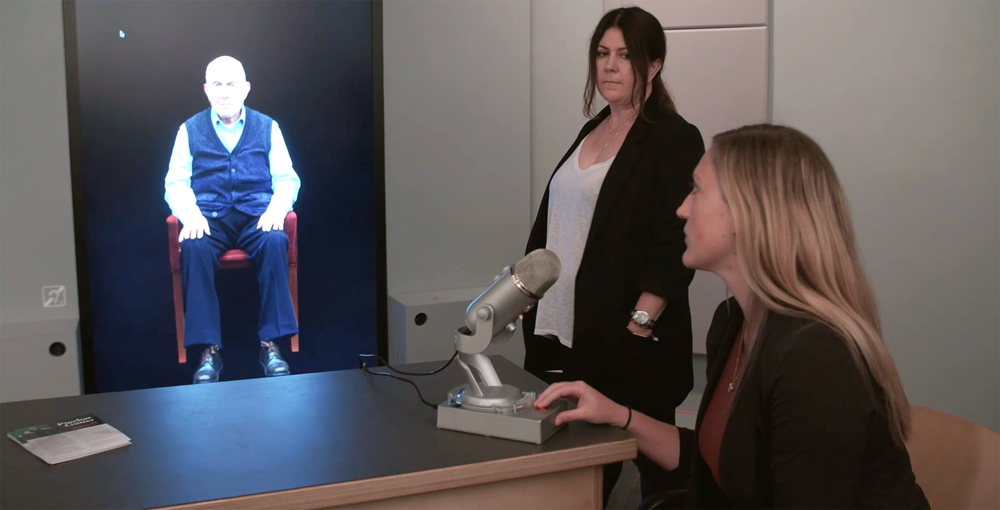

# Lifelike Virtual Characters for Scenario-Based Learning

## Introduction

The concept of using interactive, AI-powered characters for education and training has been around for years, but recent advancements in generative AI have dramatically expanded the possibilities. Here are two early examples that showcase the progression:

## Examples

### 1. History Education: Dimensions in Testimony (2014)

<figure markdown="span">
  { loading=lazy }
  <figcaption>New Dimension in Testimony project - Retrieved from <a href="https://sfi.usc.edu/news/2016/05/11444-new-dimensions-testimony-display-ushmm" target="_blank" rel="noopener">"Witness for the Future" project website</a> </figcaption>
</figure>

The USC Shoah Foundation's Dimensions in Testimony project was an early pioneer in creating interactive historical figures:

- Uses AI to create interactive holograms of Holocaust survivors, aiming to preserve firsthand accounts of historical events for future generations
- Allows viewers to ask questions and receive responses as if having a real conversation with a historical figure
- Available in museums and educational institutions, and now integrated into online platforms like [IWitness](https://iwitness.usc.edu/home)

### 2. Business Negotiation Skills: HUMAINE (2020)

HUMAINE (HUMan Multi-Agent Immersive NEgotiation) is a platform developed at Rensselaer Polytechnic Institute that supports multilateral negotiations between humans and AI agents in an immersive environment.

- Involves multilateral negotiations (e.g., one buyer with two vendors)
- Set in an immersive environment where agents are represented by avatars
- Allows natural interaction through speech and gesture, not just text
- Forms the basis for a new league in the Automated Negotiating Agents Competition, with its first competition (HUMAINE 2020) held at IJCAI-PRICAI in Yokohama, July 2020.

## The Generative AI Revolution

Now, with the bloom of large language models and generative AI, creating lifelike virtual characters for scenario-based learning has become much more accessible:

- **Easier Development**: Generative AI models can be fine-tuned or prompted to take on specific roles or personalities without extensive pre-recording or programming.
- **Improved Natural Language Understanding**: Modern AI can better understand context, nuance, and implicit information in user inputs.
- **Dynamic Responses**: Generative AI can create more varied and contextually appropriate responses on the fly, rather than relying on pre-recorded options.
- **Multimodal Capabilities**: Emerging AI models can generate text, speech, and even visual content, allowing for more immersive and realistic virtual characters.

## Further Exploration

For those interested in delving deeper into the practical aspects of implementing these technologies, we have prepared a separate [article](role-playing.md). This resource provides a more in-depth look at the creation of virtual characters using generative AI, including some of the challenges and advanced techniques involved. 

It's worth noting that the materials provided within the article only offer a preliminary demonstration of how to create virtual characters using custom GPT or most Large Language Models (LLMs).
