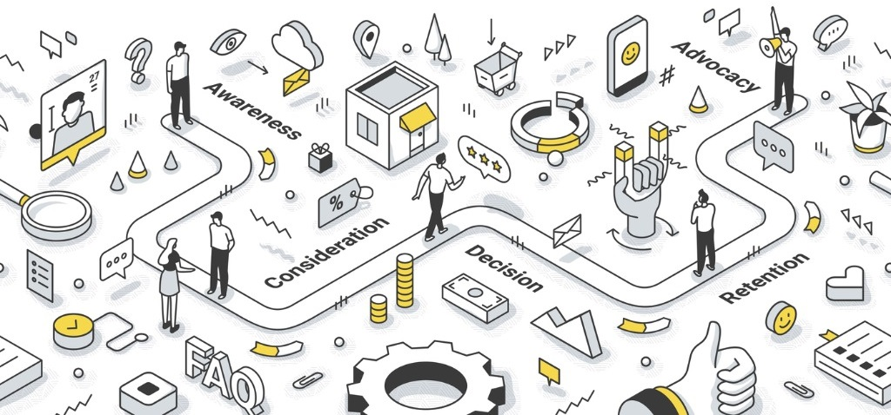
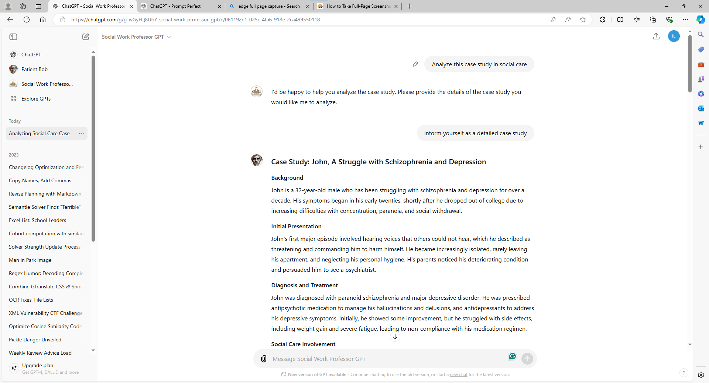
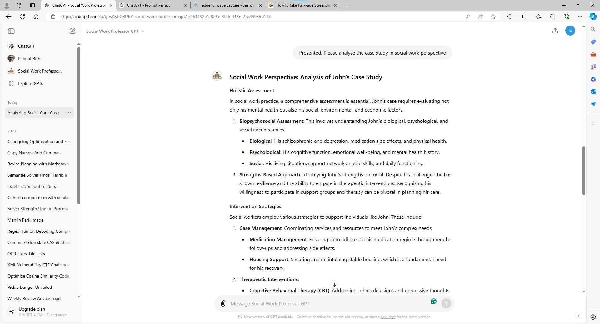

# Virtual Patient Simulation via Generative AI

## Introduction



Virtual patient simulation via Generative AI is an innovative approach to education within the Faculty of Social Science at CUHK. It leverages generative AI to provide students with realistic, interactive patient scenarios that closely mimic real-world situations. This technology enhances students' understanding of theoretical concepts while honing practical skills in a safe, controlled environment. It's particularly beneficial in disciplines like psychology, sociology, and social work, where interacting with individuals experiencing various psychological or sociological issues is crucial.

!!! note "Benefits"
    - Enhances understanding of theoretical concepts
    - Hones practical skills in a safe environment
    - Allows students to practice and refine diagnostic and therapeutic skills
    - Provides immediate feedback
    - Builds confidence in handling complex situations

## Scope

The scope of virtual patient simulations using generative AI is broad, encompassing various applications:

1. **Simple Chatbots with Pre-Prompted Responses**: At the most basic level, virtual patient simulations can be implemented using chatbots that are pre-prompted with specific scenarios and responses, helping students practice communication skills and basic diagnostic techniques.
2. **Command-Based Interactions like FlowGPT**: Incorporating command-based interactions similar to FlowGPT can further enhance the functionality of virtual patient simulations. This allows for more dynamic and flexible conversations, where students can use specific commands to guide the interaction, explore different diagnostic paths, and receive tailored feedback based on their responses.
3. **Advanced Interactive Systems like Convai**: More sophisticated simulations can involve interactive systems such as Convai, which enable students to interact with visual characters. These characters can display a range of emotions and behaviours, providing a more immersive and realistic experience. This level of simulation can enhance students' ability to recognise and respond to non-verbal cues and complex emotional states.
4. **Simulations Involving Volunteers with Psychological/Sociological Issues**: Another advanced application is building simulations on top of interactions with volunteers who exhibit psychological or sociological problems. This approach can provide highly authentic scenarios for students to engage with, allowing for deeper learning and understanding of human behaviour and mental health issues.

### Existing Products and Applications

!!! info "Note"
    These product may not be directly relevant to generative AI or higher education.

1. **Virtual Patient Simulations for Psychology and Counselling**:
    - **SIMmersion's Counselling Simulations**: This platform offers simulations where students can practice counselling techniques with virtual patients exhibiting various psychological issues. These simulations help students develop their diagnostic and therapeutic skills in a controlled environment.
    - **Kognito for Higher Education**: Kognito provides virtual patient simulations designed for training in areas such as mental health counselling and crisis intervention. Their simulations allow students to engage in role-play conversations with virtual patients, improving their ability to handle sensitive situations.
2. **Interactive Case Studies for Social Work and Psychology**:
    - Projects similar to **Virtual Interactive Practice (VIP)** could be adapted for social sciences to provide interactive case studies, allowing students to practice assessment and intervention skills with virtual clients. While VIP is focused on nurse training, the principles of using structured competency-based and scenario-based simulations can be applied to multi and inter-professional learning in social sciences.
3. **AI-Powered Mental Health Chatbots**:
    - **Woebot and Wysa** are AI chatbots adapted for mental health recovery. These chatbots can be used for role-reversal scenarios, where students act as patients, experiencing therapeutic techniques from the client's perspective. This dual approach helps students understand the dynamics of patient-provider interactions better.
4. **Virtual Reality (VR) Simulations**:
    - Universities with adequate hardware use VR technology to create immersive simulations for training psychology and social work students, enhancing practical skills through interaction with virtual patients.


## AI Prompts for Virtual Patient Simulations

Creating effective AI prompts is crucial for developing realistic and educational virtual patient simulations. These prompts serve as stepping stones and can be fine-tuned based on educational goals and desired simulation complexity.

!!! note
    The following examples illustrate how prompts may enhance learning experiences in higher education and social sciences, building on concepts from the **Existing Products and Applications** section.

### Basic Diagnostic Skills

!!! example "Anxiety Assessment"
    **Prompt:** "You are a patient referred for anxiety. Describe your symptoms, duration, and potential triggers when asked by the psychology student conducting your initial assessment."

    **Expected Response:** "I've been feeling very anxious for the past six months. I get a racing heart, sweaty palms, and I feel really nervous, especially in social situations or when I have to speak in public."

    ??? tip
        Encourage students to ask follow-up questions to gather more detailed information about the patient's symptoms and triggers.

### Therapeutic Techniques Practice

!!! example "Depression and CBT"
    **Prompt:** "You are a patient suffering from depression. Share your negative thoughts and experiences as the counselling student uses cognitive-behavioural techniques to explore and challenge these thoughts."

    **Expected Response:** "I often think that I'm worthless and that nothing will ever get better. I feel like a burden to everyone around me."

    ??? tip
        Guide students to identify cognitive distortions and apply specific CBT techniques in their responses.

### Crisis Intervention

!!! example "Suicidal Ideation"
    **Prompt:** "You are a teenager expressing suicidal thoughts. Engage with the social work student responding to your crisis call to assess your safety and provide immediate support."

    **Expected Response:** "I don't see the point of anything anymore. I just want everything to stop. I've even thought about how I would end my life."

    ??? warning
        Ensure students are prepared for emotionally challenging scenarios and provide resources for debriefing after the simulation.

### Role-Reversal Scenarios

!!! example "Chronic Illness Diagnosis"
    **Prompt:** "You are a patient who has just been diagnosed with a chronic illness. Express your concerns and emotions to the healthcare provider."

    **Expected Response:** "I'm really scared about what this diagnosis means for my future. I don't know how I'm going to manage everything, and I'm worried about the impact on my family."

    ??? tip
        Encourage students to practice empathetic listening and clear communication of medical information.

### Interdisciplinary Team Scenarios

!!! example "Complex Patient Care"
    **Prompt:** "You are a social worker discussing social support and community resources for a patient with complex needs. Engage with the nursing student who will discuss the medical aspects of the care plan."

    **Expected Response:** (AI as nursing student) "The patient has multiple chronic conditions that require regular monitoring and medication management. We need to ensure they have a stable routine for their medications and follow-up visits with specialists. Additionally, they might need home health care services to help with daily activities and medical procedures."

    ??? tip
        Focus on promoting effective interdisciplinary communication and collaborative care planning.

### Ethical Dilemmas

!!! example "Confidentiality and Illegal Activities"
    **Prompt:** "You are a patient confiding in a psychology student about engaging in illegal activities. Describe your situation and see how the student handles it while maintaining ethical standards."

    **Expected Response:** "I've been involved in some illegal activities to make ends meet. I'm really scared of getting caught, but I don't see any other way to support my family right now."

    ??? warning
        Ensure students are familiar with relevant ethical guidelines and mandatory reporting laws before engaging in this scenario.

These preliminary prompts provide a foundation for developing more complex and tailored scenarios. By leveraging AI, educators can create diverse and dynamic learning experiences that prepare students for real-world challenges in diagnosis, therapeutic techniques, crisis intervention, and ethical decision-making.

## Leveraging GPT Custom Models for Case Studies and Investigations

Check [A conversation with Social Work Professor GPT and Patient Bob](https://chatgpt.com/share/a4f0a263-4524-46bd-9931-9ec8031395cd) – we created this conversation within 2 minutes that involves two different GPTs. (Required VPN for access)

## Example: Leveraging Custom GPTs for Instant Social Work Case Studies

Custom GPTs such as Patient Bob and Social Work Professor can be utilised to swiftly create and analyse social work case scenarios. Here's how to use them effectively:

<figure markdown>
  
  <figcaption>Simulation 1: Patient Bob generating a case study</figcaption>
</figure>

<figure markdown>
  
  <figcaption>Simulation 2: Social Work Professor analysing the case</figcaption>
</figure>

!!! example "Demonstration"
    You may check [above conversation with Social Work Professor GPT and Patient Bob](https://chatgpt.com/share/a4f0a263-4524-46bd-9931-9ec8031395cd) in OpenAI.

    We created this conversation within 2 minutes, using the two custom GPTs. (Required VPN for access)

!!! note "Quick Start Guide"
    Using fine-tuned custom models may aid in creating cases manually, allowing you to jump directly into complex scenarios and their professional analysis.

### 1. Access Custom GPTs

Navigate to the ChatGPT interface and select the specific Custom GPT you wish to use.

!!! example "Available GPTs"
    - Patient Bob: For generating case studies
    - Social Work Professor: For analysing cases from a social work perspective

### 2. Generate Case Study with Patient Bob

!!! tip "Step 1"
    Initiate a conversation with Patient Bob and request a case study.

    **Example Prompt:**
    ```
    Create a detailed case study of a patient with schizophrenia and depression.
    ```

### 3. Analyse with Social Work Professor

!!! tip "Step 2"
    Switch to the Social Work Professor GPT and paste the case study generated by Patient Bob.

    **Example Prompt:**
    ```
    Please analyse this case study from a social work perspective.
    ```

### 4. Delve Deeper (Optional)

!!! tip "Step 3"
    Ask follow-up questions to either GPT to explore specific aspects of the case or analysis.

    **Example Prompts:**
    ```
    What intervention strategies would be most effective for this patient?
    How might the patient's social support network impact their treatment?
    ```

### Benefits

- Rapid generation of realistic, complex case studies
- Instant professional analysis from a social work perspective
- Efficient tool for teaching, learning, and practising social work concepts
- Ability to quickly iterate through various scenarios and perspectives

!!! success "Time-Saving"
    This approach allows you to create and analyse detailed case studies in minutes, significantly reducing preparation time for lessons or study sessions.