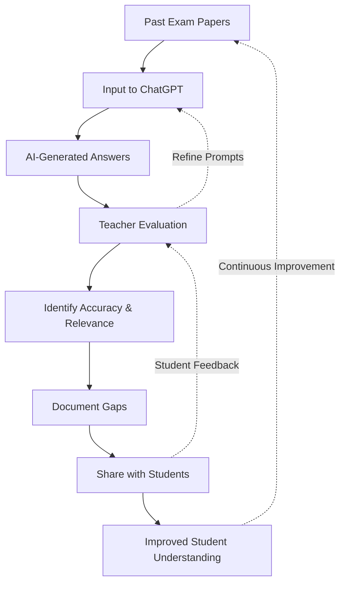
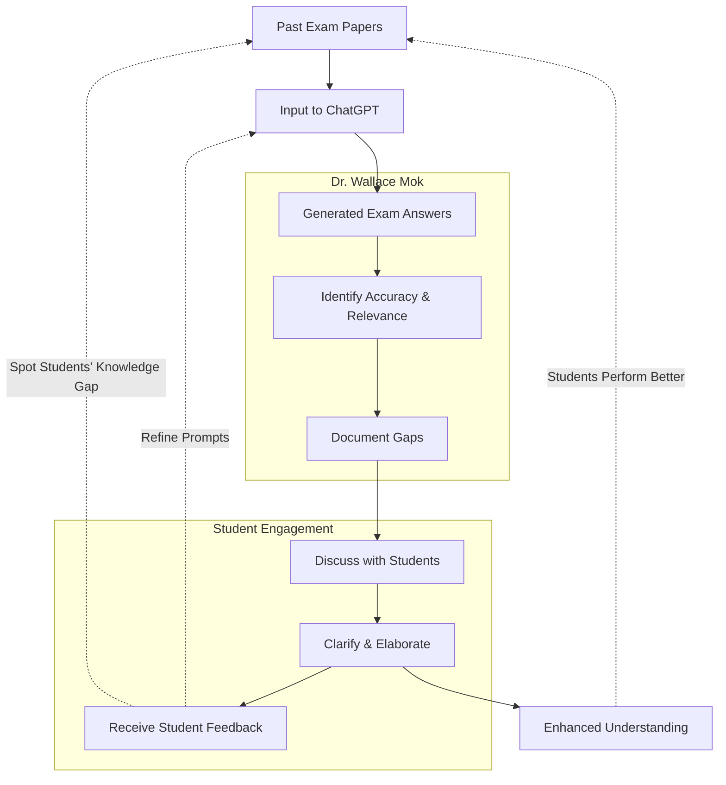

# Benchmark Exam Answers in Economics

### Introduction

???+ info "Case Study Information"

    - **Institution**: CUHK
    - **Faculty Member**: Dr. MOK Kai Chung, Wallace  
    - **Department**: Economics  
    - **Implementation Period**: Oct 2024 - Mar 2025  

!!! quote "Editor's Note"
    
    This case study showcases a practical assessment approach. Dr. Mok's approach gives students a baseline to compare their own answers against "real examples". By clarifying the course's expectations and identifing common misconceptions, he shows where **surface-level knowledge** (from a generalised LLM) **falls short** and **makes assessment standards clear and intuitive**.

    Wallace concluded that he will give a B/B+ to AI-generated answers.

### Overview

Our colleague Dr. Mok found a clever way to help students understand assessment standards in his Economics courses. He fed past exam papers into ChatGPT, examined the answers it produced, and used these to show students the difference between AI-generated responses and what's actually expected in his teaching.

What makes his approach particularly valuable is how he uses these AI outputs as discussion points. By analysing where the AI falls short, he can elaborate on course concepts in a deeper, more relatable way. Students not only see what makes a "fair" versus a "good" answer, but also gain insight into how to structure their thinking around complex economic principles.

### Implementation Method

???+ example "The Process"

    1. **Paper Selection**: Dr. Mok selected past midterm papers from two specific courses - ECON3021 and GLEF3010 - from the years 2024 and 2025.
    
    2. **AI Processing**: For the 2024 papers, he used GPT-4o to process the papers and o1 model to generate answers. An earlier attempt using image OCR proved unworkable and was abandoned. For 2025, he streamlined the process by using o3-mini for both tasks.
    
    3. **Comparative Discussion**: Dr. Mok uses the generated answers as teaching tools, highlighting both strengths and shortcomings to guide students toward better conceptual understanding. *He plans to share more details about his evaluation methods and how he refined this approach to suit his teaching style.*

### Prompt Approach (2025 AI Processing Pipeline)

Dr. Mok selected a two-stage process for processing exam papers. First converting them to LaTeX format for better handling of mathematical notation, then generating detailed answers. This approach ensures accurate representation of complex economics equations and structured responses. (to prevent unexpected layout issues when feeding docx/pdf files directly)

???+ example "Two-Stage Answering Exam Paper Question"
    *This version also allows students to experiment with the process in their own time*
    
    ```
    Prompt:
    - The following is a LaTex version of a past exam paper.
    - Analyse and provide detailed explanations for the multiple choice(s) questions in Section A, the short-answer questions in Section B and the structured questions in Section C.
    - Ensure to address economics concepts based on the details in each question.
    - Output table data and figure data to prevent missing inputs.
    - Strive for the highest possible score with accurate and error-free responses.
    - Present all your answers formatted in LaTeX, enclosed within code blocks to ensure proper formatting. Include all necessary components such as the document preamble and \texttt{\textbackslash begin{document}} and \texttt{\textbackslash end{document}} commands.
    - To reduce margins, include the following in the preamble: \usepackage[margin=1in]{geometry}
    ```

???+ example "PDF/Docx to LaTex Conversion"
    ```
    I have attached an academic document, likely from the field of economics. Please process this document and convert its content to LaTeX format, adhering to the following guidelines:

    1. Preserve all mathematical equations, symbols, subscripts, and superscripts accurately.
    2. Use appropriate LaTeX environments and commands to represent the document's structure and formatting.
    3. For inline equations, use single dollar signs. Example: $y = mx + b$
    4. For display equations, use double dollar signs. Example:
       $$
       \frac{dY}{dt} = \alpha Y(1-\frac{Y}{K})
       $$
    5. Interpret lowercase letters immediately following variables as subscripts, unless context clearly indicates otherwise.
    6. If you encounter ambiguous notation or terminology, interpret it based on standard economic conventions and the document's context.

    Ensure proper spacing and formatting:
    7. Use \section* for main sections and \subsection* for subsections if applicable.
    8. For numbered questions, use the enumerate environment with custom labels if necessary.
    9. Add vertical space between questions using \vspace{10pt} or similar.
    10. Use \noindent at the beginning of paragraphs that shouldn't be indented.
    11. For multi-part questions, use nested enumerate environments with appropriate labels.
    12. Ensure the converted LaTeX is complete and can be compiled into a document that closely resembles the original.
    13. To reduce margins, include the following in the preamble:
        \usepackage[margin=1in]{geometry}

    Example structure:
    \documentclass{article}
    \usepackage[margin=1in]{geometry}
    \usepackage{amsmath}
    \usepackage{enumitem}

    \begin{document}

    \section*{Section Title}
    \begin{enumerate}[label=\arabic*.]
      \item First question
      \vspace{10pt}
      \item Second question with parts
      \begin{enumerate}[label=(\alph*)]
        \item Part a
        \item Part b
      \end{enumerate}
      \vspace{10pt}
    \end{enumerate}

    \end{document}

    If you're unsure about any notation or how to represent it in LaTeX, please indicate this in your response.

    The converted LaTeX will be used as input for an OpenAI model to answer questions about the document's content. Therefore, accuracy in preserving the original meaning and notation is crucial.

    Please provide the LaTeX conversion of the attached document.
    ```

### Key Findings (and Evidence, if you can share a few interesting comparisons)

#### Strengths of AI-Generated Answers
- [To be filled with your own observations]

#### Limitations and Gaps
- [To be filled with your own observations]




