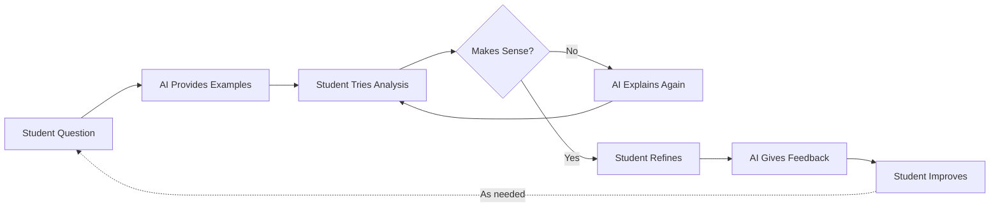

# Address Student Research Challenges in Projects

### Introduction

???+ info "Idea Source"
    **Institution**: The Chinese University of Hong Kong (CUHK)  
    **Faculty Member**: Dr. MOK Kai Chung, Wallace  
    **Department**: Economics  
    **Course**: ECON2901 (Guided Study in Current Economic Problems I)  

!!! quote "Editor's Note"
    Dr. Mok shares observations from supervising undergraduate research projects and suggests AI-based approaches to help students develop their research skills. 

    Dr. Mok expects AI to assist students analyses regression results, refine research questions, find relevant economic literature and machine learning approach, and troubleshoot data issues. His goal is to use AI as first-line support so he can focus on helping students with truly complex aspects of their research rather than repeatedly explaining basic concepts. This approach respects both his time and the students' learning journey.

### What He Has Observed

While supervising ECON2901 (Guided Study in Current Economic Problems I), a mandatory undergraduate course in the Economics programme, Dr. Mok has identified recurring challenges that hinder student performance in their research projects.

#### Observation 1: Limited Regression Skills

Many students in ECON2901 struggle with applying statistical methods in their group projects. While they may have taken ECON2121 (Methods of Economic Statistics), this foundation often proves insufficient for the research demands they face.

???+ example "Related Issues"

    **Inefficient Consultations**  
    Students request face-to-face meetings for basic methodology guidance but often leave these sessions without fully understanding the explanations, creating a frustrating cycle for both students and supervisors.
    
    **Underdeveloped Economic Thinking**  
    Many students propose preliminary research ideas that lack economic rigour or relevance, suggesting they haven't connected theoretical knowledge to practical applications.

    **Curriculum Timing**  
    More advanced courses like ECON3121 (Introductory Econometrics) and intermediate economics courses (ECON3011 and ECON3021 for Micro- and Macroeconomics) that would provide stronger foundations typically come after students complete ECON2901, often in year 3 or the second semester of year 2. This hinders their ability to make informed choices in the group project course.

#### Approach 1: Using AI to Make Regression More Accessible

Dr. Mok believes AI chatbots can provide what textbooks and lectures sometimes can't: interactive, personalised guidance that responds to each student's specific questions and level of understanding.



???+ tip "Learning Through Examples"

    AI can support students by:
    
    - Breaking down regression concepts with intuitive numerical examples
    - Providing sample datasets that demonstrate specific techniques
    - Walking students through step-by-step analysis procedures
    - Explaining statistical outputs in plain language
    
    Dr. Mok has seen how this approach bridges the gap between theoretical knowledge and practical application.

    ???- example "Example Guidance"
        Dr. Mok envisions interactions like this:
        
        ```yaml
        Student: "I need to analyse how income affects housing prices but I'm stuck."
        
        AI: "Let's make this simple:
        
        1. Here's what you're looking at:
        - You want to predict: Housing prices
        - Based on: Income levels
        
        2. This is a basic linear relationship:
        Price = β₀ + β₁(Income) + ε
        
        3. Try this R code:
        ```r
        # Load libraries
        library(tidyverse)
        
        # Import your data
        data <- read.csv("your_data.csv")
        
        # Run the regression
        model <- lm(housing_price ~ income, data = data)
        
        # See your results
        summary(model)
        
        # Make a simple graph
        ggplot(data, aes(x = income, y = housing_price)) +
            geom_point() +
            geom_smooth(method = "lm") +
            labs(title = "Income vs Housing Prices",
                x = "Income", y = "Housing Price")
        ```
        
        What part would you like me to explain?"
        ```

#### Observation 2: Ineffective Research Question Development

Dr. Mok has noticed students waste considerable time on unfocused literature searches because they start with vague or misaligned research questions.

#### Approach 2: AI-Guided Research Question Refinement

???+ tip "From Vague Ideas to Focused Questions"

    Dr. Mok suggests AI can help students:
    
    - Explore potential research angles from initial concepts
    - Connect their interests to relevant economic theories
    - Identify similar published research without extensive literature searches
    - Refine broad topics into specific, testable questions
    - A few AI-powered research tools, like Elicit, Scispace or Research Rabbits, enables students to conduct literature research and academic writing in one portal.

He observed that when students start with "something about housing," AI can guide them toward specific questions like "How do interest rate changes affect first-time home buyer purchases in Hong Kong?"—a much more productive starting point.

#### Observation 3: Limited Methodological Repertoire

Most students default to basic OLS regression because it's familiar, even when other techniques might be more appropriate for their research questions.

#### Approach 3: Introducing Advanced Methods Accessibly

???+ example "Beyond Basic Regression"
    Dr. Mok believes AI can introduce students to techniques like:
    
    - Panel data approaches
    - Instrumental variables
    - Difference-in-differences methods
    - Simple machine learning applications
    
    ???- note "Example Guidance"

        ```yaml
        Student: "I'm analysing data from multiple years for different countries."
        
        AI: "It sounds like you have panel data. Instead of simple OLS, you might consider:
        
        1. Fixed effects model: This accounts for unobserved factors specific to each country
        2. Random effects model: Useful when you think country-specific effects are uncorrelated with other variables
        
        Here's how you could implement a fixed effects model in R:
        
        ```r
        library(plm)
        panel_model <- plm(y ~ x1 + x2, data = your_data, 
                          index = c("country", "year"), 
                          model = "within")
        summary(panel_model)
        ```
        
        Would you like me to explain when to choose fixed vs. random effects?"
        ```

### The Teacher's Essential Role

!!! quote "Dr. Mok's Perspective"
    "It's like when you're ill—would you rely solely on Web search result or see a qualified doctor? ChatGPT gives students initial guidance, but domain expertise remains crucial for deeper learning."

Dr. Mok emphasises that AI serves as a starting point, not a replacement for department guidance. By encouraging students to use AI for initial exploration, he's found they come to consultations with:

- More refined, specific questions that truly require expertise
- Basic understanding that allows for deeper discussions
- Clear starting points rather than complete confusion
- Greater confidence in their research direction

Even when AI gives imperfect suggestions, Dr. Mok sees valuable teaching opportunities. He can help students evaluate methodological approaches critically—itself an essential research skill.