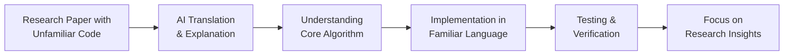

# Simplify, Understand and Convert Codes for Research

### Introduction

???+ info "Idea Source"
    **Institution**: The Chinese University of Hong Kong (CUHK)  
    **Faculty Member**: Dr. MOK Kai Chung, Wallace  
    **Department**: Economics  

!!! quote "Editor's Note"

    Dr. Mok discuss how AI chatbots can help both researchers and students overcome language barriers in code, making research more accessible and implementation more efficient. Dr. Mok sees this approach as particularly valuable when time constraints or learning curves would otherwise limit research accessibility in: 

    - Interdisciplinary research where code from other fields may use unfamiliar languages
    - Teaching students how to implement algorithms from research papers
    - Quickly assessing whether new methodological papers are relevant to current research
    - Reducing barriers to entry for students interested in computational economics

### The Challenge of Code Across Languages

Understanding and implementing algorithms from research papers often requires deciphering code written in unfamiliar programming languages. For economics research, this might mean facing Fortran or MATLAB code when you primarily work in R or Python. This language barrier creates significant friction in the research process.

#### For Researchers: Rapid Research Assessment

Dr. Mok has found that AI tools can significantly reduce the time needed to understand new research methodologies by helping with code comprehension and conversion.

???+ example "Research Implementation Benefits"

    - **Quick assessment of relevance**: Understand key algorithms without deep dives into unfamiliar syntax
    - **Lower implementation costs**: Translate methodologies to preferred languages (R, Python) for testing
    - **Methodology verification**: Compare original and translated implementations to ensure accuracy
    - **Focus on concepts**: Spend time on the research ideas rather than syntax peculiarities

???- tip "Example Prompting Approach"

    ```yaml
    I need to understand this Fortran code from an economics paper on dynamic stochastic general equilibrium models. Please explain what it does and provide an equivalent implementation in R:
    
    [paste Fortran code block]
    
    Please explain:
    1. The algorithm's key steps
    2. The variables and their purpose
    3. Any mathematical or statistical techniques being implemented
    4. An equivalent R implementation with comments
    ```

#### For Students: Language Barriers Removed

Students often struggle when assigned readings include code in languages they haven't learned, creating an additional barrier to understanding key concepts.

???+ tip "Learning Benefits for Students"
    - **Broader access to resources**: Students can learn from materials regardless of programming language
    - **Skill transfer**: Apply existing programming knowledge to new languages
    - **Focus on concepts**: Understand the algorithm's logic without getting stuck on syntax
    - **Implementation practice**: Convert theoretical algorithms to working code in familiar languages

#### Implementation Approaches



???+ example "Code Understanding Workflow"

    1. Identify key algorithm sections in the research paper
    2. Request AI explanation of the code's purpose and logic
    3. Ask for equivalent code in your preferred language
    4. Request breakdown of variables and their purposes
    5. Verify mathematical equivalence between implementations
    6. Test with sample data to ensure correct behaviour

???+ warning "Important Limitations"

    - AI translations may not be perfect, especially for highly complex or specialised algorithms
    - Always verify translated code against the original algorithm's intended behaviour
    - Some language-specific optimisations may be lost in translation
    - Citation of original code sources remains essential for academic integrity


