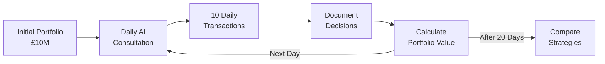

# Learn Investment Strategy Through AI-Guided Simulations

### Introduction

???+ info "Idea Source"
    **Institution**: The Chinese University of Hong Kong (CUHK)  
    **Faculty Member**: Dr. MOK Kai Chung, Wallace  
    **Department**: Economics  

!!! quote "Editor's Note"

    This article explores an interactive learning approach where students test AI-generated investment strategies in simulated environments. This exercise encourages students to integrate AI into realistic scenarios while developing critical judgement about both the AI tool and investment problems. By comparing diverse results from the same starting point, students gain insight into how their interaction approach directly affects outcomes.

### A Hands-On Approach to Understanding Investment

Building on his experiences with AI-assisted research guidance, Dr. Mok proposes a practical exercise that combines financial theory with AI interaction skills. This simulation helps students understand both investment principles and effective AI prompting techniques.

#### The Simulation Framework

The concept involves students participating in a controlled investment simulation where they must use AI to guide trading decisions within specific parameters.

???+ example "The Basic Setup"

    - Each student begins with a hypothetical £10 million investment fund
    - Students must conduct 10 stock transactions daily over approximately 20 trading days
    - All investment advice must come from AI interactions
    - Students document all AI conversations and track investment outcomes
    - Final portfolio values determine which strategies were most successful

#### Learning Objectives Beyond Numbers

Dr. Mok designed this exercise to teach several interconnected skills that build on the research guidance concepts from his previous approaches.

???+ tip "Key Learning Outcomes"

    **Developing Effective AI Prompting Skills**

    - Students learn to craft detailed investor profiles (risk tolerance, goals, time horizons)
    - They discover which prompt structures yield the most useful investment guidance
    - They experience how prompt specificity affects AI response quality
    
    **Understanding Investment Strategy**

    - Students witness how different AI-suggested approaches perform under market conditions
    - They develop critical thinking about investment advice through results analysis
    - They connect theoretical concepts from courses to practical implementation

#### Implementation Requirements

To maintain educational integrity and ensure comparable results, Dr. Mok established specific guidelines for the simulation.

???+ warning "Critical Simulation Rules"

    - Students must interact with AI in real-time each trading day
    - No asking AI to generate past or future suggestions to "catch up" or "get ahead"
    - All interactions must be documented with timestamps (conversation thread saved)
    - Portfolios must be tracked using a standardised spreadsheet template
    - Students must justify each transaction based on the AI guidance received

#### From Simulation to Real-World Applications

???+ example "Building Towards Applied Skills"
    Dr. Mok sees this exercise connecting to real-world applications through:
    
    - Comparing how different students prompt the same AI system with the same starting conditions but achieve vastly different results
    - Analysing which types of investment strategies AI tends to favour and why
    - Discussing the limitations of AI financial advice and what human expertise adds
    - Examining how students might integrate AI tools into actual investment decisions
